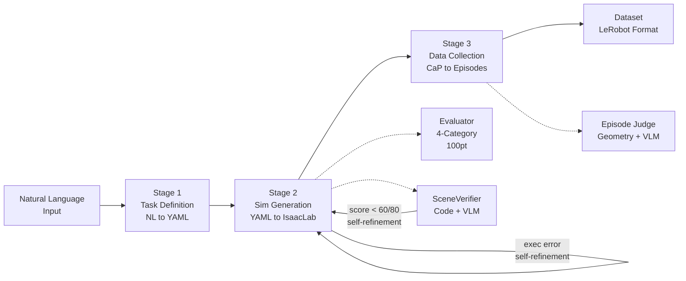

# Simulation-Generation-Agent (RAPIDS)

[ English](README.md) | [ 한국어](docs/ko/README.md) | [ 中文](docs/zh/README.md) | [ 日本語](docs/ja/README.md) | [ Deutsch](docs/de/README.md)

[](LICENSE)
[](https://www.python.org/)
[](https://github.com/isaac-sim/IsaacLab)
[](https://docs.omniverse.nvidia.com/isaacsim/)
[](README.docker.md)
[](https://openai.com/)
[](https://github.com/huggingface/lerobot)

An end-to-end robotics simulation automation framework that converts natural language task descriptions into structured YAML specs, auto-generates IsaacLab simulation environments, executes Code-as-Policies (CaP) robot manipulation, and collects training-ready demonstration datasets.

```bash
git clone --recurse-submodules <repo-url> && cd Simulation-Generation-Agent
pip install -e . && cp .env.example .env  # Set OPENAI_API_KEY in .env
./run_agent.sh "Stack the blocks inside the tray on the table"
```

See [docs/getting_started.md](docs/getting_started.md) for full setup and [docs/architecture.md](docs/architecture.md) for pipeline details.

---

## Pipeline Overview



| Stage | What It Does | Key Technology |
|-------|-------------|----------------|
| **1. Task Definition** | NL to structured YAML task spec | LangChain RAG (FAISS vector matching) + LLM task decomposition |
| **2. Simulation Generation** | YAML to IsaacLab environment Python code | LLM code generation + PhysX runtime validation + auto error fix + VLM scene verification |
| **3. Data Collection** | Robot manipulation on generated env + successful demo collection | CaP skill code generation + Pinocchio IK + Geometry/VLM dual evaluation |

Detailed architecture: [docs/architecture.md](docs/architecture.md)

## Quick Start

### 1. Installation

```bash
git clone --recurse-submodules <repo-url>
cd Simulation-Generation-Agent
pip install -e .
cp .env.example .env    # Set OPENAI_API_KEY
```

### 2. Run

```bash
./run_agent.sh "Stack the blocks inside the tray on the table"
```

With options:
```bash
./run_agent.sh "Stack the blocks inside the tray on the table" --robot franka --episodes 5
```

### 3. Run with Docker

```bash
git submodule update --init --recursive
docker build -t simgen-agent .

docker run --rm --gpus all \
  -v $(pwd)/artifacts:/workspace/artifacts \
  -v $(pwd)/outputs:/workspace/Simulation-Generation-Agent/outputs \
  -e OPENAI_API_KEY="your-key" \
  simgen-agent \
  "Stack the blocks inside the tray on the table" --episodes 5
```

> **Output path**: Inside Docker, results are saved to `/workspace/artifacts`.
> The `-v` flag maps it to `./artifacts/` on the host.
> For local runs, outputs go to `outputs/`.

### 4. Individual Stage Execution (Advanced)

```bash
# Stage 2 only: YAML to IsaacLab environment code
./run_agent.sh --mode isaac-lab --task tasks/franka/stack/franka_stack.yaml

# Stage 3 only: Data collection
./run_agent.sh --mode data-collection --task tasks/franka/stack/franka_stack.yaml

# Large-scale batch collection
./run_agent.sh --mode e2e-batch --config configs/docker/e2e_batch_release.yaml --resume
```

<details>
<summary>Running Python scripts directly (for developers)</summary>

```bash
# Stage 1: NL to YAML
python3 scripts/task_spec_agent/task_spec_agent.py "Stack the blocks" --robot franka --output task.yaml

# Stage 2: YAML to IsaacLab
python3 scripts/run_isaac_lab.py task.yaml --evaluate

# Stage 3: Data collection
python3 scripts/run_data_collection.py task.yaml --env-dir outputs/isaaclab/<run_dir> --target-success 5

# Run all 13 tasks end-to-end
bash scripts/run_full_test.sh
```
</details>

## Supported Robots

| Robot | DOF | Gripper | Notes |
|-------|-----|---------|-------|
| Franka Panda | 9 (7+2) | Parallel Jaw | Primary test robot |
| UR10e | 12 (6+6) | Robotiq 2F-85 | Industrial |
| OpenARM | 9 (7+2) | Parallel Jaw | Low-cost open-source |
| SO-101 | 6 (5+1) | Parallel Jaw | Educational compact |

## Token Usage Tracking

```bash
export TOKEN_USAGE_FILE=outputs/token_usage.jsonl
export TOKEN_USAGE_LOG=1  # Real-time console logging
./run_agent.sh "Stack the blocks inside the tray on the table"
# Per-step and per-model token report printed on completion
```

## Project Structure

```text
Simulation-Generation-Agent/
├── Dockerfile                    # Docker image build configuration
├── requirements.txt              # Python dependency list
├── run_agent.sh                  # Main entry point (full pipeline)
├── .env.example                  # Environment variable template
├── LICENSE                       # MIT License
├── src/main.py                   # Main entry point
├── scripts/
│   ├── task_spec_agent/          # Stage 1: NL to YAML
│   │   ├── task_spec_agent.py    #   Main orchestrator
│   │   ├── nl_parser.py          #   NL parsing (LLM)
│   │   ├── task_decomposer.py    #   Task decomposition (LLM)
│   │   ├── feasibility_validator.py  # Physical feasibility check
│   │   ├── rag_match_yaml_generator.py # RAG vector-match YAML gen
│   │   └── llm_client.py         #   Multi-LLM client
│   ├── run_isaac_lab.py          # Stage 2 entry point
│   ├── run_data_collection.py    # Stage 3 entry point
│   ├── run_e2e_batch.py          # E2E Batch entry point
│   └── run_full_test.sh          # Full Pipeline (Stage 1->2->3)
├── src/agent/
│   ├── common/                   # LLM client, token tracker, MCP
│   ├── isaac_lab/                # Stage 2: env code generation + evaluation
│   │   ├── agent.py              #   IsaacLabAgent (LLM code gen)
│   │   ├── scene_verifier.py     #   VLM scene verification (code 4-cat + image)
│   │   └── evaluator/            #   4-category 100pt evaluation
│   ├── isaac_sim/                # Isaac Sim visual verification (auxiliary)
│   ├── data_collection/          # Stage 3: data collection
│   │   ├── pipeline.py           #   DataCollectionPipeline
│   │   ├── sim_skills.py         #   6-DOF IK robot control
│   │   ├── sim_judge.py          #   Geometry + VLM success evaluation
│   │   ├── cap_generator.py      #   CaP code generation
│   │   └── e2e_orchestrator.py   #   E2E batch orchestrator
│   ├── kinematics/               # IK/FK engine (Pinocchio)
│   └── task_search/              # Task YAML catalog/search
├── configs/                      # Configuration files
│   ├── robot_profiles/           #   Per-robot profiles (joints, gripper, IK)
│   └── docker/                   #   Docker-specific batch configs
├── tasks/                        # Task YAML corpus (82 tasks)
├── prompts/                      # LLM system prompts
├── assets/                       # Local USD/URDF assets
├── external/AutoDataCollector/   # ADC submodule (judge prompts, IK utils)
├── data/                         # Sample input data, RAG vector store
└── docs/                         # User documentation
```

## Task Corpus

- Total task YAMLs: 82
- Robots: Franka (28), OpenARM (24), SO-101 (13), UR10e (17)
- Categories: Stack, Lift, Pick&Place, Sort, Cabinet, Assembly, Peg Insert, Reach

## Documentation

| Document | Description |
|----------|-------------|
| [docs/architecture.md](docs/architecture.md) | 3-Stage pipeline architecture, module relationships, data flow |
| [docs/getting_started.md](docs/getting_started.md) | Installation, environment variables, submodule setup, first run |
| [docs/usage.md](docs/usage.md) | CLI usage, options, output structure, result interpretation |
| [README.docker.md](README.docker.md) | Docker build/run guide |
| [CONTRIBUTING.md](CONTRIBUTING.md) | Contribution guidelines |
| [LICENSE](LICENSE) | MIT License |

## Notes

- Generated artifacts are saved to `outputs/` for local runs and `/workspace/artifacts` for Docker.
- The IK engine (`src/agent/kinematics/`) is Pinocchio-based and requires `pip install pin`. Falls back to IsaacLab DifferentialIK if Pinocchio is not installed.
- Isaac Sim MCP visual verification is for local development only and is not supported in Docker.
