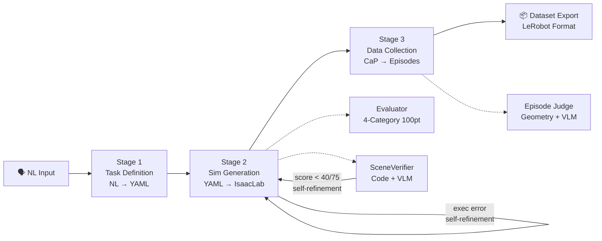
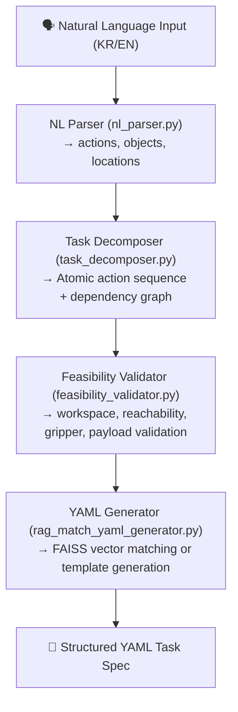
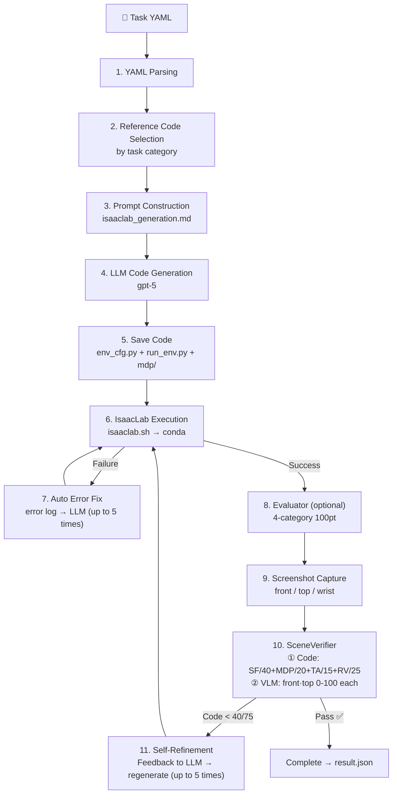

# Pipeline Architecture

[ English](architecture.md) | [ 한국어](ko/architecture.md) | [ 中文](zh/architecture.md) | [ 日本語](ja/architecture.md) | [ Deutsch](de/architecture.md)

Audience: Users who want to understand the overall system flow
This document covers: 3-Stage pipeline structure, internal workings of each Stage, inter-module relationships
For CLI usage see `docs/usage.md`, for installation see `docs/getting_started.md`

---

## Overall Pipeline

Given a natural language task description as input, a trainable demonstration dataset is automatically generated through 3 stages.



| Stage | Input | Core Operation | Output | Entry Point |
|-------|-------|----------------|--------|-------------|
| **1. Task Definition** | Natural language sentence | RAG search + LLM few-shot generation | `task.yaml` | `scripts/task_spec_agent/task_spec_agent.py` |
| **2. Simulation Generation** | task.yaml | LLM code generation + IsaacLab execution verification | `env_cfg.py` + `run_env.py` + `mdp/` | `scripts/run_isaac_lab.py` |
| **3. Data Collection** | task.yaml + env_dir | CaP skill code generation → IK execution → evaluation → recording | `raw_dataset/` | `scripts/run_data_collection.py` |

---

## Stage 1: Task Definition (NL → YAML)

> Implementation location: `scripts/task_spec_agent/`

Converts natural language commands into structured YAML task specifications. Internally, it goes through a 4-step pipeline.



### Module Roles

| Module | Input | Output | Description |
|--------|-------|--------|-------------|
| **NL Parser** | Natural language sentence | `ParsedTask` (actions, objects, locations) | Generates structured output by specifying a JSON schema to the LLM |
| **Task Decomposer** | `ParsedTask` | `TaskPlan` (AtomicAction list + dependencies) | Decomposes into atomic actions such as reach, grasp, lift, place. Validates cycles via topological sort |
| **Feasibility Validator** | `TaskPlan` | `ValidationResult` (is_valid, errors, warnings) | 6 physical validations based on robot profiles (workspace, reachability, gripper, payload, etc.) |
| **RAG YAML Generator** | Natural language + ParsedTask + TaskPlan | YAML string | Matches and returns the most similar existing task YAML via FAISS vector search |

### RAG Vector Search

- Embedding model: `sentence-transformers/all-MiniLM-L6-v2`
- Vector store: `data/vector_store/index.faiss` (auto-generated on first run)
- Search source: 82 existing YAMLs in the `tasks/` directory
- Robot type filtering supported (franka, ur10e, openarm, so101)

---

## Stage 2: Simulation Generation (YAML → IsaacLab)

> Implementation location: `src/agent/isaac_lab/agent.py`

Automatically generates IsaacLab `ManagerBasedRLEnv` Python code from a YAML task specification and verifies execution.



### SceneVerifier Output Structure

```json
{
  "code_evaluation": {
    "scene_fidelity": {"score": 36, "max": 40, "details": "..."},
    "mdp_correctness": {"score": 17, "max": 20, "details": "..."},
    "task_alignment": {"score": 13, "max": 15, "details": "..."},
    "runtime_validity": {"score": 22, "max": 25, "details": "..."},
    "total_score": 92, "max_score": 100
  },
  "image_evaluation": {
    "front": {"score": 85, "reasoning": "..."},
    "top": {"score": 78, "reasoning": "..."},
    "vlm_pass": true
  },
  "overall_pass": true
}
```

### Generated Code Structure

```
outputs/isaaclab/{TaskName}_{timestamp}/
├── env_cfg.py          # Main environment configuration
│   ├── SceneCfg        # Robot, objects, lighting, ground
│   ├── ActionsCfg      # Joint/gripper control settings
│   ├── ObservationsCfg # Observation definitions
│   ├── RewardsCfg      # Reward functions
│   ├── TerminationsCfg # Termination conditions
│   └── EventCfg        # Initialization/randomization events
├── run_env.py          # Runner (AppLauncher → env creation → verification)
├── mdp/                # Custom MDP functions (if needed)
│   ├── __init__.py     # Re-exports isaaclab.envs.mdp + custom modules
│   ├── rewards.py      # Custom reward functions
│   └── terminations.py # Custom termination conditions
├── debug/              # Environment screenshots (front/top/wrist)
└── result.json         # Execution results + scene_verification included
```

### YAML → IsaacLab Mapping Rules

| YAML Section | IsaacLab Mapping |
|-------------|-----------------|
| `robot` (articulation) | Uses presets (`FRANKA_PANDA_CFG`, `UR10e_ROBOTIQ_2F_85_CFG`, etc.) |
| `robot.initial_joints` | `ArticulationCfg.init_state.joint_pos` |
| `assets` (rigid) | `RigidObjectCfg` (USD or primitive based) |
| `assets.position/rotation` | `init_state` configuration |
| `assets.physics` | `RigidBodyPropertiesCfg`, `CollisionPropertiesCfg` |
| `simulation.*` | `__post_init__` (decimation, episode_length, dt, PhysX) |
| `goal.conditions` | Custom `mdp/terminations.py` |
| `randomization` | `EventTermCfg` (reset events) |

### Isaac Sim Visual Verification (Auxiliary Path)

In addition to IsaacLab, there is also a visual verification path utilizing the Isaac Sim MCP extension.

- Communicates with Isaac Sim via TCP connection (`localhost:8766`)
- YAML → MCP `execute_script` → scene construction → screenshot → VLM evaluation
- `src/agent/isaac_sim/` (runner.py, scene_builder.py, screenshot.py, vlm_evaluator.py)

---

## Stage 3: Data Collection (CaP → Dataset)

> Implementation location: `src/agent/data_collection/`

The robot performs tasks on top of the simulation environment generated in Stage 2, and only successful episodes are recorded as a dataset.

```
Task YAML + IsaacLab Environment Code
    │
    ▼
┌────────────────────────────────────────────────────────┐
│  DataCollectionPipeline  (pipeline.py)                  │
│                                                        │
│  1. Load robot profile (configs/robot_profiles/*.yaml)  │
│  2. Auto-generate collect_data.py                       │
│  3. Execute as subprocess in IsaacLab conda env         │
│                                                        │
│  ┌────────────────────────────────────────────────┐    │
│  │  collect_data.py (inside IsaacLab subprocess)   │    │
│  │                                                │    │
│  │  while success_count < target:                 │    │
│  │    ┌──────────┐                                │    │
│  │    │ env.reset│  Initialize environment         │    │
│  │    └────┬─────┘                                │    │
│  │         ▼                                      │    │
│  │    ┌──────────┐                                │    │
│  │    │ Detect   │  Detect object positions from   │    │
│  │    │          │  scene graph                    │    │
│  │    └────┬─────┘                                │    │
│  │         ▼                                      │    │
│  │    ┌──────────┐                                │    │
│  │    │ Plan     │  LLM generates CaP skill code   │    │
│  │    │          │  (pick, place, stack, etc.)     │    │
│  │    └────┬─────┘                                │    │
│  │         ▼                                      │    │
│  │    ┌──────────┐                                │    │
│  │    │ Execute  │  6-DOF IK (Pinocchio) +        │    │
│  │    │          │  PD joint control              │    │
│  │    └────┬─────┘                                │    │
│  │         ▼                                      │    │
│  │    ┌──────────┐                                │    │
│  │    │ Judge    │  Geometry check + VLM verdict   │    │
│  │    └────┬─────┘                                │    │
│  │         ▼                                      │    │
│  │    ┌──────────┐                                │    │
│  │    │ Record   │  Save on success / discard on   │    │
│  │    │          │  failure                        │    │
│  │    └──────────┘                                │    │
│  └────────────────────────────────────────────────┘    │
└────────────────────────────────────────────────────────┘
    │
    ▼
  raw_dataset/ → export → preprocess → LeRobot Hub
```

### Core Modules

| Module | Role |
|--------|------|
| **SimDetector** (`sim_detector.py`) | Detects object positions/poses from the IsaacLab scene graph |
| **SkillPlanner** (`skill_planner.py`) | LLM-based skill sequence planning (task description + detection results → skill list) |
| **SimSkills** (`sim_skills.py`) | 6-DOF IK (Pinocchio) based robot control. pick, place, stack, move_to_ready, etc. |
| **SimCamera** (`sim_camera.py`) | Multi-camera system (top: bird's-eye view, wrist: hand-mounted, front: VLM verdict + dataset) |
| **SimJudge** (`sim_judge.py`) | 3-tier success verification: (1) Geometry, (2) VLM, (3) env flag |
| **SimRecorder** (`sim_recorder.py`) | Per-step observation/action/image/skill metadata storage. Discards failed episodes |

### Episode Success Determination

After an episode ends, it goes through a 2-stage evaluation:

1. **Geometry Verification** -- Directly verifies goal conditions using scene graph coordinates (on_top_of, at_position, etc.)
2. **VLM Judge** -- gpt-5 examines 4 before/after images (wrist+front) to determine success

Final determination policy (`geometry_or_vlm`):

| Geometry | VLM | Included in Dataset? |
|----------|-----|---------------------|
| Pass | Pass | Yes |
| Pass | Fail | Yes |
| Fail | Pass | Yes |
| Fail | Fail | No (discarded) |

If at least one of geometry or VLM passes, the episode is included in the dataset.

### Raw Dataset Schema

| Field | dtype | Shape | Description |
|-------|-------|-------|-------------|
| `observation.state` | float32 | (N_dof,) | Joint positions |
| `action` | float32 | (N_dof,) | Joint control targets |
| `observation.images.{top,wrist,front}` | image | (480, 640, 3) | Camera images |
| `skill.natural_language` | string | (1,) | Skill natural language description |
| `skill.type` | string | (1,) | Skill type |
| `skill.progress` | float32 | (1,) | Progress |
| `skill.goal_position.joint` | float32 | (N_dof,) | Target joint positions |
| `skill.goal_position.world_xyzrpy` | float32 | (6,) | World coordinate target |
| `skill.goal_position.robot_xyzrpy` | float32 | (6,) | Robot base frame target |
| `skill.goal_position.gripper` | float32 | (1,) | Gripper state |

**N_dof by robot:** Franka=9, OpenARM=9, UR10e=12, SO-101=6

### Data Post-Processing

```
raw_dataset/
    │  scripts/export_dataset.py (adc_compatible schema)
    ▼
exported_datasets/
    │  scripts/preprocess_dataset.py (train/val split)
    ▼
preprocessed_datasets/ (train.jsonl, val.jsonl, stats.json)
    │  LeRobot conversion (optional)
    ▼
LeRobot Hub (HuggingFace)
```

---

## Shared Infrastructure

These are the base modules shared across Stages 1, 2, and 3.

| Module | Location | Role |
|--------|----------|------|
| **LLM Client** | `src/agent/common/llm_client.py` | OpenAI Responses API wrapper. Automatically handles gpt-5 temperature unsupported |
| **Token Tracker** | `src/agent/common/token_tracker.py` | API token usage tracking (JSONL cross-process). Real-time logging + table reports |
| **MCP Client** | `src/agent/common/mcp_client.py` | TCP communication with Isaac Sim MCP extension (localhost:8766) |
| **IsaacLab Runtime** | `src/agent/common/isaaclab_runtime.py` | IsaacLab path resolution, conda command construction, GPU environment variable setup |
| **Task Docs** | `src/agent/common/task_docs.py` | YAML task document loading/validation/serialization |

---

## Execution Entry Point Mapping

Which script runs which part of the pipeline:

| Script | Execution Scope | Description |
|--------|----------------|-------------|
| **`run_agent.sh`** | **Stage 1 → 2 → 3** | **Main execution entry point (natural language input → full pipeline)** |
| `run_agent.sh --mode isaac-lab` | Stage 2 only | YAML → environment code generation/verification |
| `run_agent.sh --mode data-collection` | Stage 3 only | Data collection with existing environment |
| `run_agent.sh --mode e2e-batch` | Stage 2 → 3 + post-processing | Config-based large-scale batch collection |
| `scripts/run_full_test.sh` | Stage 1 → 2 → 3 | Sequential benchmark of 13 tasks |

> `run_agent.sh "natural language task"` is the **main entry point** that starts from Stage 1 (NL→YAML).
> You can also run individual Stages using the `--mode` option.

---

## Supported Robots

| Robot | DOF | Gripper | Notes |
|-------|-----|---------|-------|
| Franka Panda | 9 (7+2) | Parallel Jaw | Default test robot |
| UR10e | 12 (6+6) | Robotiq 2F-85 | Industrial |
| OpenARM | 9 (7+2) | Parallel Jaw | Low-cost open-source |
| SO-101 | 6 (5+1) | Parallel Jaw | Educational compact |

---

## Related Documents

- CLI usage: [docs/usage.md](usage.md)
- Installation: [docs/getting_started.md](getting_started.md)
