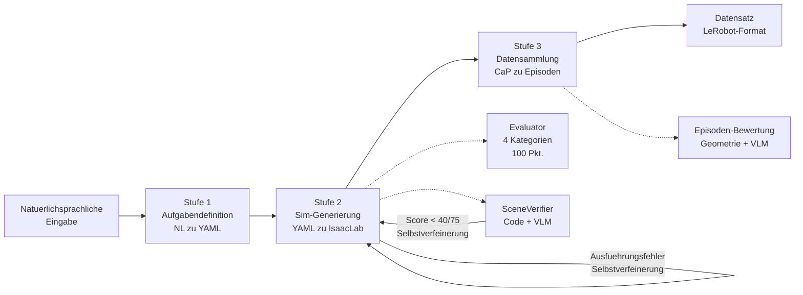

# Simulation-Generation-Agent (RAPIDS)

[ English](../../README.md) | [ 한국어](../ko/README.md) | [ 中文](../zh/README.md) | [ 日本語](../ja/README.md) | [ Deutsch](README.md)

[](../../LICENSE)
[](https://www.python.org/)
[](https://github.com/isaac-sim/IsaacLab)
[](https://docs.omniverse.nvidia.com/isaacsim/)
[](docker.md)
[](https://openai.com/)
[](https://github.com/huggingface/lerobot)

Ein End-to-End-Automatisierungsframework fuer Robotersimulation, das natuerlichsprachliche Aufgabenbeschreibungen in strukturierte YAML-Spezifikationen umwandelt, automatisch IsaacLab-Simulationsumgebungen generiert, Code-as-Policies (CaP) Robotermanipulation ausfuehrt und trainingsbereite Demonstrationsdatensaetze sammelt.

```bash
git clone --recurse-submodules <repo-url> && cd Simulation-Generation-Agent
pip install -e . && cp .env.example .env  # OPENAI_API_KEY in .env setzen
./run_agent.sh "Stack the blocks inside the tray on the table"
```

Siehe [getting_started.md](getting_started.md) fuer die vollstaendige Einrichtung und [architecture.md](architecture.md) fuer Pipeline-Details.

---

## Pipeline-Uebersicht



| Stufe | Beschreibung | Kerntechnologie |
|-------|-------------|----------------|
| **1. Aufgabendefinition** | NL zu strukturierter YAML-Aufgabenspezifikation | LangChain RAG (FAISS-Vektorabgleich) + LLM-Aufgabenzerlegung |
| **2. Simulationsgenerierung** | YAML zu IsaacLab-Umgebungs-Python-Code | LLM-Codegenerierung + PhysX-Laufzeitvalidierung + automatische Fehlerkorrektur + VLM-Szenenverifikation |
| **3. Datensammlung** | Robotermanipulation in generierter Umgebung + Sammlung erfolgreicher Demonstrationen | CaP-Skill-Codegenerierung + Pinocchio IK + Geometrie-/VLM-Doppelbewertung |

Detaillierte Architektur: [architecture.md](architecture.md)

## Schnellstart

### 1. Installation

```bash
git clone --recurse-submodules <repo-url>
cd Simulation-Generation-Agent
pip install -e .
cp .env.example .env    # OPENAI_API_KEY setzen
```

### 2. Ausfuehren

```bash
./run_agent.sh "Stack the blocks inside the tray on the table"
```

Mit Optionen:
```bash
./run_agent.sh "Stack the blocks inside the tray on the table" --robot franka --episodes 5
```

### 3. Mit Docker ausfuehren

```bash
git submodule update --init --recursive
docker build -t simgen-agent .

docker run --rm --gpus all \
  -v $(pwd)/artifacts:/workspace/artifacts \
  -e OPENAI_API_KEY="your-key" \
  simgen-agent \
  "Stack the blocks inside the tray on the table" --episodes 5
```

> **Ausgabepfad**: In Docker werden Ergebnisse unter `/workspace/artifacts` gespeichert.
> Das `-v`-Flag bildet diesen Pfad auf `./artifacts/` auf dem Host ab.
> Bei lokaler Ausfuehrung werden Ausgaben unter `outputs/` gespeichert.

### 4. Einzelne Stufen ausfuehren (Fortgeschritten)

```bash
# Nur Stufe 2: YAML zu IsaacLab-Umgebungscode
./run_agent.sh --mode isaac-lab --task tasks/franka/stack/franka_stack.yaml

# Nur Stufe 3: Datensammlung
./run_agent.sh --mode data-collection --task tasks/franka/stack/franka_stack.yaml

# Grossangelegte Batch-Sammlung
./run_agent.sh --mode e2e-batch --config configs/docker/e2e_batch_release.yaml --resume
```

<details>
<summary>Python-Skripte direkt ausfuehren (fuer Entwickler)</summary>

```bash
# Stufe 1: NL zu YAML
python3 scripts/task_spec_agent/task_spec_agent.py "Stack the blocks" --robot franka --output task.yaml

# Stufe 2: YAML zu IsaacLab
python3 scripts/run_isaac_lab.py task.yaml --evaluate

# Stufe 3: Datensammlung
python3 scripts/run_data_collection.py task.yaml --env-dir outputs/isaaclab/<run_dir> --target-success 5

# Alle 13 Aufgaben End-to-End ausfuehren
bash scripts/run_full_test.sh
```
</details>

## Unterstuetzte Roboter

| Roboter | DOF | Greifer | Anmerkungen |
|---------|-----|---------|-------------|
| Franka Panda | 9 (7+2) | Parallelgreifer | Primaerer Testroboter |
| UR10e | 12 (6+6) | Robotiq 2F-85 | Industriell |
| OpenARM | 9 (7+2) | Parallelgreifer | Kostenguenstiger Open-Source-Roboter |
| SO-101 | 6 (5+1) | Parallelgreifer | Kompakter Bildungsroboter |

## Token-Verbrauchsverfolgung

```bash
export TOKEN_USAGE_FILE=outputs/token_usage.jsonl
export TOKEN_USAGE_LOG=1  # Echtzeit-Konsolenprotokollierung
./run_agent.sh "Stack the blocks inside the tray on the table"
# Pro-Schritt- und Pro-Modell-Token-Bericht wird bei Abschluss ausgegeben
```

## Projektstruktur

```text
Simulation-Generation-Agent/
├── Dockerfile                    # Docker-Image-Build-Konfiguration
├── requirements.txt              # Python-Abhaengigkeitsliste
├── run_agent.sh                  # Haupt-Einstiegspunkt (vollstaendige Pipeline)
├── .env.example                  # Umgebungsvariablen-Vorlage
├── LICENSE                       # MIT-Lizenz
├── src/main.py                   # Haupt-Einstiegspunkt
├── scripts/
│   ├── task_spec_agent/          # Stufe 1: NL zu YAML
│   │   ├── task_spec_agent.py    #   Haupt-Orchestrator
│   │   ├── nl_parser.py          #   NL-Parsing (LLM)
│   │   ├── task_decomposer.py    #   Aufgabenzerlegung (LLM)
│   │   ├── feasibility_validator.py  # Physische Machbarkeitspruefung
│   │   ├── rag_match_yaml_generator.py # RAG-Vektorabgleich-YAML-Generierung
│   │   └── llm_client.py         #   Multi-LLM-Client
│   ├── run_isaac_lab.py          # Stufe 2 Einstiegspunkt
│   ├── run_data_collection.py    # Stufe 3 Einstiegspunkt
│   ├── run_e2e_batch.py          # E2E-Batch-Einstiegspunkt
│   └── run_full_test.sh          # Vollstaendige Pipeline (Stufe 1->2->3)
├── src/agent/
│   ├── common/                   # LLM-Client, Token-Tracker, MCP
│   ├── isaac_lab/                # Stufe 2: Umgebungscode-Generierung + Evaluation
│   │   ├── agent.py              #   IsaacLabAgent (LLM-Codegenerierung)
│   │   ├── scene_verifier.py     #   VLM-Szenenverifikation (Code 4-Kat. + Bild)
│   │   └── evaluator/            #   4-Kategorien-100-Punkte-Evaluation
│   ├── isaac_sim/                # Isaac Sim visuelle Verifikation (Hilfsfunktion)
│   ├── data_collection/          # Stufe 3: Datensammlung
│   │   ├── pipeline.py           #   DataCollectionPipeline
│   │   ├── sim_skills.py         #   6-DOF-IK-Robotersteuerung
│   │   ├── sim_judge.py          #   Geometrie- + VLM-Erfolgsbewertung
│   │   ├── cap_generator.py      #   CaP-Codegenerierung
│   │   └── e2e_orchestrator.py   #   E2E-Batch-Orchestrator
│   ├── kinematics/               # IK/FK-Engine (Pinocchio)
│   └── task_search/              # Aufgaben-YAML-Katalog/Suche
├── configs/                      # Konfigurationsdateien
│   ├── robot_profiles/           #   Roboterprofile (Gelenke, Greifer, IK)
│   └── docker/                   #   Docker-spezifische Batch-Konfigurationen
├── tasks/                        # Aufgaben-YAML-Korpus (82 Aufgaben)
├── prompts/                      # LLM-Systemprompts
├── assets/                       # Lokale USD/URDF-Assets
├── external/AutoDataCollector/   # ADC-Submodul (Bewertungsprompts, IK-Hilfsfunktionen)
├── data/                         # Beispieldaten, RAG-Vektorspeicher
└── docs/                         # Benutzerdokumentation
```

## Aufgabenkorpus

- Gesamtzahl der Aufgaben-YAMLs: 82
- Roboter: Franka (28), OpenARM (24), SO-101 (13), UR10e (17)
- Kategorien: Stapeln, Heben, Aufnehmen und Ablegen, Sortieren, Schrank, Montage, Stift einsetzen, Erreichen

## Dokumentation

| Dokument | Beschreibung |
|----------|-------------|
| [architecture.md](architecture.md) | 3-Stufen-Pipeline-Architektur, Modulbeziehungen, Datenfluss |
| [getting_started.md](getting_started.md) | Installation, Umgebungsvariablen, Submodul-Einrichtung, erster Lauf |
| [usage.md](usage.md) | CLI-Nutzung, Optionen, Ausgabestruktur, Ergebnisinterpretation |
| [dataset.md](dataset.md) | Datensatz-Export, LeRobot-Konvertierung, HuggingFace-Upload |
| [docker.md](docker.md) | Docker-Build-/Ausfuehrungsanleitung |
| [CONTRIBUTING.md](../../CONTRIBUTING.md) | Beitragsrichtlinien |
| [LICENSE](../../LICENSE) | MIT-Lizenz |

## Hinweise

- Generierte Artefakte werden bei lokaler Ausfuehrung unter `outputs/` und in Docker unter `/workspace/artifacts` gespeichert.
- Die IK-Engine (`src/agent/kinematics/`) basiert auf Pinocchio und erfordert `pip install pin`. Sie faellt auf IsaacLab DifferentialIK zurueck, wenn Pinocchio nicht installiert ist.
- Die visuelle Verifikation ueber Isaac Sim MCP ist nur fuer die lokale Entwicklung vorgesehen und wird in Docker nicht unterstuetzt.
