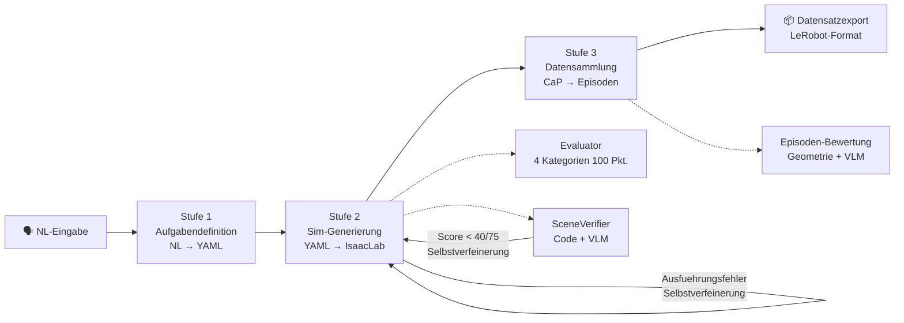
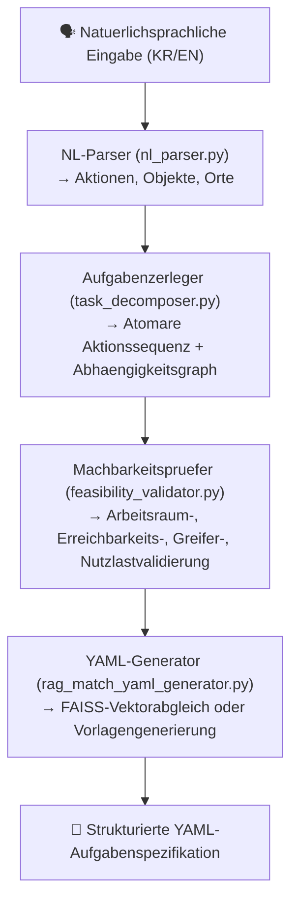
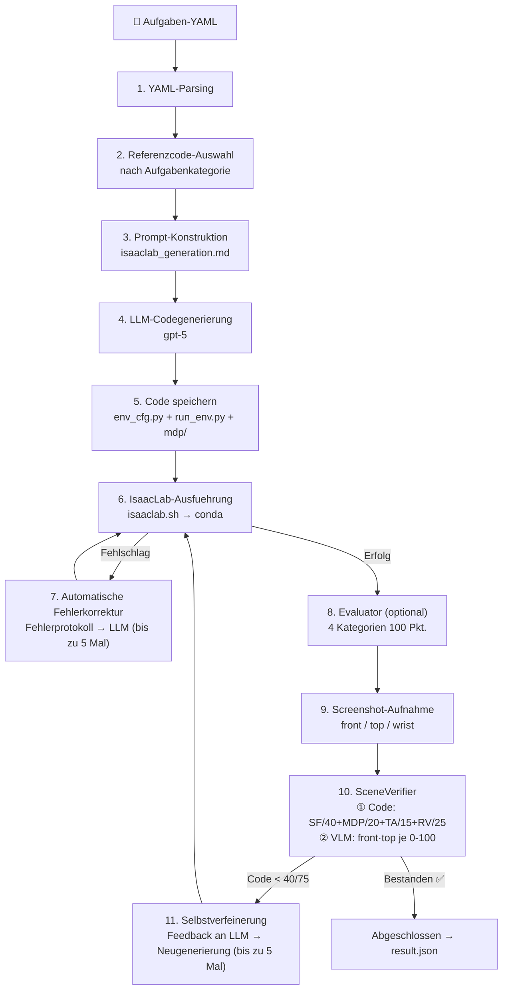

# Pipeline-Architektur

[ English](../architecture.md) | [ 한국어](../ko/architecture.md) | [ 中文](../zh/architecture.md) | [ 日本語](../ja/architecture.md) | [ Deutsch](architecture.md)

Zielgruppe: Nutzer, die den gesamten Systemablauf verstehen moechten
Dieses Dokument behandelt: 3-Stufen-Pipeline-Struktur, interne Funktionsweise jeder Stufe, Modulbeziehungen
Fuer CLI-Nutzung siehe `docs/de/usage.md`, fuer Installation siehe `docs/de/getting_started.md`

---

## Gesamt-Pipeline

Bei Eingabe einer natuerlichsprachlichen Aufgabenbeschreibung wird automatisch in 3 Stufen ein trainierbarer Demonstrationsdatensatz generiert.



| Stufe | Eingabe | Kernoperation | Ausgabe | Einstiegspunkt |
|-------|---------|---------------|---------|----------------|
| **1. Aufgabendefinition** | Natuerlichsprachlicher Satz | RAG-Suche + LLM-Few-Shot-Generierung | `task.yaml` | `scripts/task_spec_agent/task_spec_agent.py` |
| **2. Simulationsgenerierung** | task.yaml | LLM-Codegenerierung + IsaacLab-Ausfuehrungsverifikation | `env_cfg.py` + `run_env.py` + `mdp/` | `scripts/run_isaac_lab.py` |
| **3. Datensammlung** | task.yaml + env_dir | CaP-Skill-Codegenerierung → IK-Ausfuehrung → Bewertung → Aufzeichnung | `raw_dataset/` | `scripts/run_data_collection.py` |

---

## Stufe 1: Aufgabendefinition (NL → YAML)

> Implementierungsort: `scripts/task_spec_agent/`

Wandelt natuerlichsprachliche Befehle in strukturierte YAML-Aufgabenspezifikationen um. Intern durchlaeuft dies eine 4-Schritt-Pipeline.



### Modulrollen

| Modul | Eingabe | Ausgabe | Beschreibung |
|-------|---------|---------|-------------|
| **NL-Parser** | Natuerlichsprachlicher Satz | `ParsedTask` (Aktionen, Objekte, Orte) | Erzeugt strukturierte Ausgabe durch Angabe eines JSON-Schemas an das LLM |
| **Aufgabenzerleger** | `ParsedTask` | `TaskPlan` (AtomicAction-Liste + Abhaengigkeiten) | Zerlegt in atomare Aktionen wie Erreichen, Greifen, Heben, Ablegen. Validiert Zyklen durch topologische Sortierung |
| **Machbarkeitspruefer** | `TaskPlan` | `ValidationResult` (is_valid, Fehler, Warnungen) | 6 physische Validierungen basierend auf Roboterprofilen (Arbeitsraum, Erreichbarkeit, Greifer, Nutzlast usw.) |
| **RAG-YAML-Generator** | Natuerliche Sprache + ParsedTask + TaskPlan | YAML-String | Sucht und gibt das aehnlichste vorhandene Aufgaben-YAML ueber FAISS-Vektorsuche zurueck |

### RAG-Vektorsuche

- Embedding-Modell: `sentence-transformers/all-MiniLM-L6-v2`
- Vektorspeicher: `data/vector_store/index.faiss` (wird beim ersten Lauf automatisch erstellt)
- Suchquelle: 82 vorhandene YAMLs im `tasks/`-Verzeichnis
- Robotertyp-Filterung unterstuetzt (franka, ur10e, openarm, so101)

---

## Stufe 2: Simulationsgenerierung (YAML → IsaacLab)

> Implementierungsort: `src/agent/isaac_lab/agent.py`

Generiert automatisch IsaacLab `ManagerBasedRLEnv` Python-Code aus einer YAML-Aufgabenspezifikation und verifiziert die Ausfuehrung.



### SceneVerifier-Ausgabestruktur

```json
{
  "code_evaluation": {
    "scene_fidelity": {"score": 36, "max": 40, "details": "..."},
    "mdp_correctness": {"score": 17, "max": 20, "details": "..."},
    "task_alignment": {"score": 13, "max": 15, "details": "..."},
    "runtime_validity": {"score": 22, "max": 25, "details": "..."},
    "total_score": 92, "max_score": 100
  },
  "image_evaluation": {
    "front": {"score": 85, "reasoning": "..."},
    "top": {"score": 78, "reasoning": "..."},
    "vlm_pass": true
  },
  "overall_pass": true
}
```

### Generierte Codestruktur

```
outputs/isaaclab/{TaskName}_{timestamp}/
├── env_cfg.py          # Haupt-Umgebungskonfiguration
│   ├── SceneCfg        # Roboter, Objekte, Beleuchtung, Boden
│   ├── ActionsCfg      # Gelenk-/Greifersteuerungseinstellungen
│   ├── ObservationsCfg # Beobachtungsdefinitionen
│   ├── RewardsCfg      # Belohnungsfunktionen
│   ├── TerminationsCfg # Abbruchbedingungen
│   └── EventCfg        # Initialisierungs-/Randomisierungsereignisse
├── run_env.py          # Runner (AppLauncher → Umgebungserstellung → Verifikation)
├── mdp/                # Benutzerdefinierte MDP-Funktionen (falls erforderlich)
│   ├── __init__.py     # Re-exportiert isaaclab.envs.mdp + benutzerdefinierte Module
│   ├── rewards.py      # Benutzerdefinierte Belohnungsfunktionen
│   └── terminations.py # Benutzerdefinierte Abbruchbedingungen
├── debug/              # Umgebungs-Screenshots (front/top/wrist)
└── result.json         # Ausfuehrungsergebnisse + scene_verification enthalten
```

### YAML → IsaacLab-Zuordnungsregeln

| YAML-Abschnitt | IsaacLab-Zuordnung |
|----------------|-------------------|
| `robot` (Artikulation) | Verwendet Voreinstellungen (`FRANKA_PANDA_CFG`, `UR10e_ROBOTIQ_2F_85_CFG` usw.) |
| `robot.initial_joints` | `ArticulationCfg.init_state.joint_pos` |
| `assets` (starr) | `RigidObjectCfg` (USD- oder Primitiv-basiert) |
| `assets.position/rotation` | `init_state`-Konfiguration |
| `assets.physics` | `RigidBodyPropertiesCfg`, `CollisionPropertiesCfg` |
| `simulation.*` | `__post_init__` (Dezimierung, Episodenlaenge, dt, PhysX) |
| `goal.conditions` | Benutzerdefinierte `mdp/terminations.py` |
| `randomization` | `EventTermCfg` (Reset-Ereignisse) |

### Isaac Sim visuelle Verifikation (Hilfspfad)

Zusaetzlich zu IsaacLab gibt es auch einen visuellen Verifikationspfad unter Nutzung der Isaac Sim MCP-Erweiterung.

- Kommuniziert mit Isaac Sim ueber TCP-Verbindung (`localhost:8766`)
- YAML → MCP `execute_script` → Szenenaufbau → Screenshot → VLM-Bewertung
- `src/agent/isaac_sim/` (runner.py, scene_builder.py, screenshot.py, vlm_evaluator.py)

---

## Stufe 3: Datensammlung (CaP → Datensatz)

> Implementierungsort: `src/agent/data_collection/`

Der Roboter fuehrt Aufgaben in der in Stufe 2 generierten Simulationsumgebung aus, und nur erfolgreiche Episoden werden als Datensatz aufgezeichnet.

```
Aufgaben-YAML + IsaacLab-Umgebungscode
    │
    ▼
┌────────────────────────────────────────────────────────┐
│  DataCollectionPipeline  (pipeline.py)                  │
│                                                        │
│  1. Roboterprofil laden (configs/robot_profiles/*.yaml) │
│  2. collect_data.py automatisch generieren              │
│  3. Als Unterprozess in IsaacLab-Conda-Umgebung         │
│     ausfuehren                                          │
│                                                        │
│  ┌────────────────────────────────────────────────┐    │
│  │  collect_data.py (im IsaacLab-Unterprozess)     │    │
│  │                                                │    │
│  │  while success_count < target:                 │    │
│  │    ┌──────────┐                                │    │
│  │    │ env.reset│  Umgebung initialisieren         │    │
│  │    └────┬─────┘                                │    │
│  │         ▼                                      │    │
│  │    ┌──────────┐                                │    │
│  │    │ Erkennen │  Objektpositionen aus            │    │
│  │    │          │  Szenengraph erkennen            │    │
│  │    └────┬─────┘                                │    │
│  │         ▼                                      │    │
│  │    ┌──────────┐                                │    │
│  │    │ Planen   │  LLM generiert CaP-Skill-Code   │    │
│  │    │          │  (pick, place, stack usw.)       │    │
│  │    └────┬─────┘                                │    │
│  │         ▼                                      │    │
│  │    ┌──────────┐                                │    │
│  │    │Ausfuehren│  6-DOF IK (Pinocchio) +         │    │
│  │    │          │  PD-Gelenksteuerung              │    │
│  │    └────┬─────┘                                │    │
│  │         ▼                                      │    │
│  │    ┌──────────┐                                │    │
│  │    │ Bewerten │  Geometriepruefung + VLM-Urteil  │    │
│  │    └────┬─────┘                                │    │
│  │         ▼                                      │    │
│  │    ┌──────────┐                                │    │
│  │    │Aufzeichn.│  Bei Erfolg speichern /          │    │
│  │    │          │  bei Misserfolg verwerfen        │    │
│  │    └──────────┘                                │    │
│  └────────────────────────────────────────────────┘    │
└────────────────────────────────────────────────────────┘
    │
    ▼
  raw_dataset/ → Export → Vorverarbeitung → LeRobot Hub
```

### Kernmodule

| Modul | Rolle |
|-------|-------|
| **SimDetector** (`sim_detector.py`) | Erkennt Objektpositionen/-posen aus dem IsaacLab-Szenengraph |
| **SkillPlanner** (`skill_planner.py`) | LLM-basierte Skill-Sequenzplanung (Aufgabenbeschreibung + Erkennungsergebnisse → Skill-Liste) |
| **SimSkills** (`sim_skills.py`) | 6-DOF-IK-basierte (Pinocchio) Robotersteuerung. pick, place, stack, move_to_ready usw. |
| **SimCamera** (`sim_camera.py`) | Mehrkamerasystem (top: Vogelperspektive, wrist: handmontiert, front: VLM-Urteil + Datensatz) |
| **SimJudge** (`sim_judge.py`) | 3-stufige Erfolgsverifikation: (1) Geometrie, (2) VLM, (3) Umgebungs-Flag |
| **SimRecorder** (`sim_recorder.py`) | Pro-Schritt-Speicherung von Beobachtung/Aktion/Bild/Skill-Metadaten. Verwirft fehlgeschlagene Episoden |

### Episodenerfolgsbestimmung

Nach Ende einer Episode durchlaeuft diese eine 2-stufige Bewertung:

1. **Geometrieverifikation** -- Verifiziert Zielbedingungen direkt anhand von Szenengraph-Koordinaten (on_top_of, at_position usw.)
2. **VLM-Bewertung** -- gpt-5 untersucht 4 Vorher-/Nachher-Bilder (wrist+front) zur Erfolgsbestimmung

Endgueltige Bestimmungsrichtlinie (`geometry_or_vlm`):

| Geometrie | VLM | Im Datensatz enthalten? |
|-----------|-----|------------------------|
| Bestanden | Bestanden | Ja |
| Bestanden | Nicht bestanden | Ja |
| Nicht bestanden | Bestanden | Ja |
| Nicht bestanden | Nicht bestanden | Nein (verworfen) |

Wenn mindestens eine der beiden Bewertungen (Geometrie oder VLM) bestanden wird, wird die Episode in den Datensatz aufgenommen.

### Rohdatensatz-Schema

| Feld | dtype | Shape | Beschreibung |
|------|-------|-------|-------------|
| `observation.state` | float32 | (N_dof,) | Gelenkpositionen |
| `action` | float32 | (N_dof,) | Gelenksteuerungsziele |
| `observation.images.{top,wrist,front}` | image | (480, 640, 3) | Kamerabilder |
| `skill.natural_language` | string | (1,) | Natuerlichsprachliche Skill-Beschreibung |
| `skill.type` | string | (1,) | Skill-Typ |
| `skill.progress` | float32 | (1,) | Fortschritt |
| `skill.goal_position.joint` | float32 | (N_dof,) | Ziel-Gelenkpositionen |
| `skill.goal_position.world_xyzrpy` | float32 | (6,) | Weltkoordinatenziel |
| `skill.goal_position.robot_xyzrpy` | float32 | (6,) | Roboter-Basisrahmen-Ziel |
| `skill.goal_position.gripper` | float32 | (1,) | Greiferzustand |

**N_dof nach Roboter:** Franka=9, OpenARM=9, UR10e=12, SO-101=6

### Datennachverarbeitung

```
raw_dataset/
    │  scripts/export_dataset.py (adc_compatible-Schema)
    ▼
exported_datasets/
    │  scripts/preprocess_dataset.py (Train/Val-Aufteilung)
    ▼
preprocessed_datasets/ (train.jsonl, val.jsonl, stats.json)
    │  LeRobot-Konvertierung (optional)
    ▼
LeRobot Hub (HuggingFace)
```

---

## Gemeinsame Infrastruktur

Dies sind die Basismodule, die von Stufe 1, 2 und 3 gemeinsam genutzt werden.

| Modul | Ort | Rolle |
|-------|-----|-------|
| **LLM Client** | `src/agent/common/llm_client.py` | OpenAI Responses API Wrapper. Behandelt automatisch fehlende gpt-5-Temperature-Unterstuetzung |
| **Token Tracker** | `src/agent/common/token_tracker.py` | API-Token-Verbrauchsverfolgung (JSONL prozessuebergreifend). Echtzeit-Protokollierung + Tabellenberichte |
| **MCP Client** | `src/agent/common/mcp_client.py` | TCP-Kommunikation mit Isaac Sim MCP-Erweiterung (localhost:8766) |
| **IsaacLab Runtime** | `src/agent/common/isaaclab_runtime.py` | IsaacLab-Pfadaufloesung, Conda-Befehlskonstruktion, GPU-Umgebungsvariablen-Setup |
| **Task Docs** | `src/agent/common/task_docs.py` | YAML-Aufgabendokument laden/validieren/serialisieren |

---

## Zuordnung der Ausfuehrungseinstiegspunkte

Welches Skript welchen Teil der Pipeline ausfuehrt:

| Skript | Ausfuehrungsumfang | Beschreibung |
|--------|-------------------|-------------|
| **`run_agent.sh`** (ohne Argumente) | **Interaktives TUI** | **Interaktives Dashboard — Einstellungen, Aufgaben ausfuehren, Verlauf durchsuchen** |
| **`run_agent.sh "Aufgabe"`** | **Stufe 1 → 2 → 3** | **CLI-Modus — natuerlichsprachliche Eingabe → vollstaendige Pipeline** |
| `run_agent.sh --mode isaac-lab` | Nur Stufe 2 | YAML → Umgebungscode-Generierung/-Verifikation |
| `run_agent.sh --mode data-collection` | Nur Stufe 3 | Datensammlung mit vorhandener Umgebung |
| `run_agent.sh --mode e2e-batch` | Stufe 2 → 3 + Nachverarbeitung | Konfigurationsbasierte grossangelegte Batch-Sammlung |
| `scripts/run_full_test.sh` | Stufe 1 → 2 → 3 | Sequenzieller Benchmark von 13 Aufgaben |

> `run_agent.sh` ohne Argumente startet das **interaktive TUI-Dashboard** (TTY erforderlich).
> `run_agent.sh "natuerlichsprachliche Aufgabe"` fuehrt die Pipeline im **CLI-Modus** aus.
> Sie koennen auch einzelne Stufen mit der Option `--mode` ausfuehren.

---

## Unterstuetzte Roboter

| Roboter | DOF | Greifer | Anmerkungen |
|---------|-----|---------|-------------|
| Franka Panda | 9 (7+2) | Parallelgreifer | Standard-Testroboter |
| UR10e | 12 (6+6) | Robotiq 2F-85 | Industriell |
| OpenARM | 9 (7+2) | Parallelgreifer | Kostenguenstiger Open-Source-Roboter |
| SO-101 | 6 (5+1) | Parallelgreifer | Kompakter Bildungsroboter |

---

## Verwandte Dokumente

- CLI-Nutzung: [docs/de/usage.md](usage.md)
- Installation: [docs/de/getting_started.md](getting_started.md)
