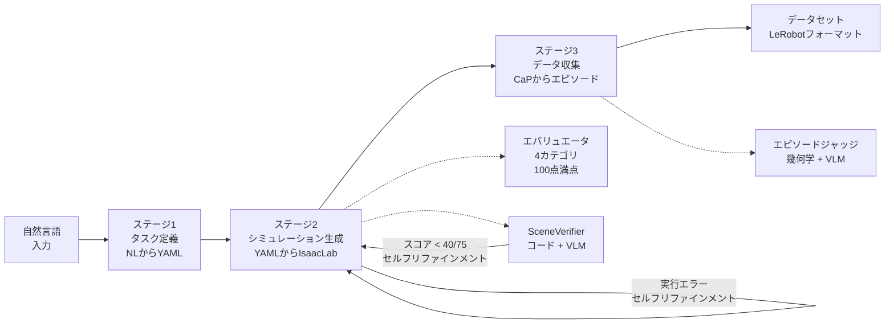

<h1 align="center">Simulation-Generation-Agent (RAPIDS)</h1>

<p align="center">
  <a href="https://skku-prism.github.io/rapid_project_test/">
    
  </a>
</p>

<p align="center">
  <a href="https://skku-prism.github.io/rapid_project_test/"></a>
</p>

---

<p align="center">
  <a href="../../README.md"> English</a> |
  <a href="../ko/README.md"> 한국어</a> |
  <a href="../zh/README.md"> 中文</a> |
  <a href="README.md"> 日本語</a> |
  <a href="../de/README.md"> Deutsch</a>
</p>

<p align="center">
  <a href="../../LICENSE"></a>
  <a href="https://www.python.org/"></a>
  <a href="https://github.com/isaac-sim/IsaacLab"></a>
  <a href="https://docs.omniverse.nvidia.com/isaacsim/"></a>
  <a href="docker.md"></a>
  <a href="https://openai.com/"></a>
  <a href="https://github.com/huggingface/lerobot"></a>
</p>

自然言語のタスク記述を構造化YAMLスペックに変換し、IsaacLabシミュレーション環境を自動生成し、Code-as-Policies（CaP）によるロボットマニピュレーションを実行し、学習用デモンストレーションデータセットを収集する、エンドツーエンドのロボティクスシミュレーション自動化フレームワークです。

```bash
git clone --recurse-submodules <repo-url> && cd Simulation-Generation-Agent
pip install -e . && cp .env.example .env  # .envにOPENAI_API_KEYを設定
./run_agent.sh "Stack the blocks inside the tray on the table"
```

完全なセットアップについては[docs/getting_started.md](getting_started.md)を、パイプラインの詳細については[docs/architecture.md](architecture.md)をご覧ください。

---

## パイプライン概要



| ステージ | 機能 | 主要技術 |
|-------|-------------|----------------|
| **1. タスク定義** | 自然言語から構造化YAMLタスクスペック | LangChain RAG（FAISSベクトルマッチング）+ LLMタスク分解 |
| **2. シミュレーション生成** | YAMLからIsaacLab環境Pythonコード | LLMコード生成 + PhysXランタイム検証 + 自動エラー修正 + VLMシーン検証 |
| **3. データ収集** | 生成環境上でのロボットマニピュレーション＋成功デモ収集 | CaPスキルコード生成 + Pinocchio IK + 幾何学/VLMデュアル評価 |

詳細なアーキテクチャ: [docs/architecture.md](architecture.md)

## クイックスタート

### 1. インストール

```bash
git clone --recurse-submodules <repo-url>
cd Simulation-Generation-Agent
pip install -e .
cp .env.example .env    # OPENAI_API_KEYを設定
```

### 2. 実行

```bash
./run_agent.sh "Stack the blocks inside the tray on the table"
```

オプション付き:
```bash
./run_agent.sh "Stack the blocks inside the tray on the table" --robot franka --episodes 5
```

### 3. Dockerで実行

```bash
git submodule update --init --recursive
docker build -t simgen-agent .

docker run --rm --gpus all \
  -v $(pwd)/artifacts:/workspace/artifacts \
  -e OPENAI_API_KEY="your-key" \
  simgen-agent \
  "Stack the blocks inside the tray on the table" --episodes 5
```

> **出力パス**: Docker内では、結果は`/workspace/artifacts`に保存されます。
> `-v`フラグによりホスト上の`./artifacts/`にマッピングされます。
> ローカル実行の場合、出力は`outputs/`に保存されます。

### 4. 個別ステージの実行（上級者向け）

```bash
# ステージ2のみ: YAMLからIsaacLab環境コード
./run_agent.sh --mode isaac-lab --task tasks/franka/stack/franka_stack.yaml

# ステージ3のみ: データ収集
./run_agent.sh --mode data-collection --task tasks/franka/stack/franka_stack.yaml

# 大規模バッチ収集
./run_agent.sh --mode e2e-batch --config configs/docker/e2e_batch_release.yaml --resume
```

<details>
<summary>Pythonスクリプトを直接実行する（開発者向け）</summary>

```bash
# ステージ1: 自然言語からYAML
python3 scripts/task_spec_agent/task_spec_agent.py "Stack the blocks" --robot franka --output task.yaml

# ステージ2: YAMLからIsaacLab
python3 scripts/run_isaac_lab.py task.yaml --evaluate

# ステージ3: データ収集
python3 scripts/run_data_collection.py task.yaml --env-dir outputs/isaaclab/<run_dir> --target-success 5

# 全13タスクをエンドツーエンドで実行
bash scripts/run_full_test.sh
```
</details>

## 対応ロボット

| ロボット | DOF | グリッパー | 備考 |
|-------|-----|---------|-------|
| Franka Panda | 9 (7+2) | パラレルジョー | 主要テストロボット |
| UR10e | 12 (6+6) | Robotiq 2F-85 | 産業用 |
| OpenARM | 9 (7+2) | パラレルジョー | 低コストオープンソース |
| SO-101 | 6 (5+1) | パラレルジョー | 教育用コンパクト |

## トークン使用量追跡

```bash
export TOKEN_USAGE_FILE=outputs/token_usage.jsonl
export TOKEN_USAGE_LOG=1  # リアルタイムコンソールログ
./run_agent.sh "Stack the blocks inside the tray on the table"
# 完了時にステップ別・モデル別のトークンレポートが出力されます
```

## プロジェクト構成

```text
Simulation-Generation-Agent/
├── Dockerfile                    # Dockerイメージビルド設定
├── requirements.txt              # Python依存パッケージリスト
├── run_agent.sh                  # メインエントリーポイント（フルパイプライン）
├── .env.example                  # 環境変数テンプレート
├── LICENSE                       # MITライセンス
├── src/main.py                   # メインエントリーポイント
├── scripts/
│   ├── task_spec_agent/          # ステージ1: 自然言語からYAML
│   │   ├── task_spec_agent.py    #   メインオーケストレータ
│   │   ├── nl_parser.py          #   自然言語解析（LLM）
│   │   ├── task_decomposer.py    #   タスク分解（LLM）
│   │   ├── feasibility_validator.py  # 物理的実現可能性チェック
│   │   ├── rag_match_yaml_generator.py # RAGベクトルマッチYAML生成
│   │   └── llm_client.py         #   マルチLLMクライアント
│   ├── run_isaac_lab.py          # ステージ2エントリーポイント
│   ├── run_data_collection.py    # ステージ3エントリーポイント
│   ├── run_e2e_batch.py          # E2Eバッチエントリーポイント
│   └── run_full_test.sh          # フルパイプライン（ステージ1→2→3）
├── src/agent/
│   ├── common/                   # LLMクライアント、トークントラッカー、MCP
│   ├── isaac_lab/                # ステージ2: 環境コード生成 + 評価
│   │   ├── agent.py              #   IsaacLabAgent（LLMコード生成）
│   │   ├── scene_verifier.py     #   VLMシーン検証（コード4カテゴリ + 画像）
│   │   └── evaluator/            #   4カテゴリ100点満点評価
│   ├── isaac_sim/                # Isaac Simビジュアル検証（補助）
│   ├── data_collection/          # ステージ3: データ収集
│   │   ├── pipeline.py           #   DataCollectionPipeline
│   │   ├── sim_skills.py         #   6-DOF IKロボット制御
│   │   ├── sim_judge.py          #   幾何学 + VLM成功評価
│   │   ├── cap_generator.py      #   CaPコード生成
│   │   └── e2e_orchestrator.py   #   E2Eバッチオーケストレータ
│   ├── kinematics/               # IK/FKエンジン（Pinocchio）
│   └── task_search/              # タスクYAMLカタログ/検索
├── configs/                      # 設定ファイル
│   ├── robot_profiles/           #   ロボット別プロファイル（関節、グリッパー、IK）
│   └── docker/                   #   Docker専用バッチ設定
├── tasks/                        # タスクYAMLコーパス（82タスク）
├── prompts/                      # LLMシステムプロンプト
├── assets/                       # ローカルUSD/URDFアセット
├── external/AutoDataCollector/   # ADCサブモジュール（ジャッジプロンプト、IKユーティリティ）
├── data/                         # サンプル入力データ、RAGベクトルストア
└── docs/                         # ユーザードキュメント
```

## タスクコーパス

- タスクYAML合計: 82
- ロボット: Franka (28)、OpenARM (24)、SO-101 (13)、UR10e (17)
- カテゴリ: スタック、リフト、ピック＆プレイス、ソート、キャビネット、アセンブリ、ペグインサート、リーチ

## ドキュメント

| ドキュメント | 説明 |
|----------|-------------|
| [architecture.md](architecture.md) | 3ステージパイプラインアーキテクチャ、モジュール間関係、データフロー |
| [getting_started.md](getting_started.md) | インストール、環境変数、サブモジュールセットアップ、初回実行 |
| [usage.md](usage.md) | CLI使用方法、オプション、出力構造、結果の解釈 |
| [dataset.md](dataset.md) | データセットエクスポート、LeRobot変換、HuggingFaceアップロード |
| [docker.md](docker.md) | Dockerビルド/実行ガイド |
| [CONTRIBUTING.md](../../CONTRIBUTING.md) | コントリビューションガイドライン |
| [LICENSE](../../LICENSE) | MITライセンス |

## 備考

- 生成されたアーティファクトはローカル実行では`outputs/`に、Dockerでは`/workspace/artifacts`に保存されます。
- IKエンジン（`src/agent/kinematics/`）はPinocchioベースで、`pip install pin`が必要です。Pinocchioがインストールされていない場合、IsaacLab DifferentialIKにフォールバックします。
- Isaac Sim MCPビジュアル検証はローカル開発環境専用で、Dockerではサポートされていません。
