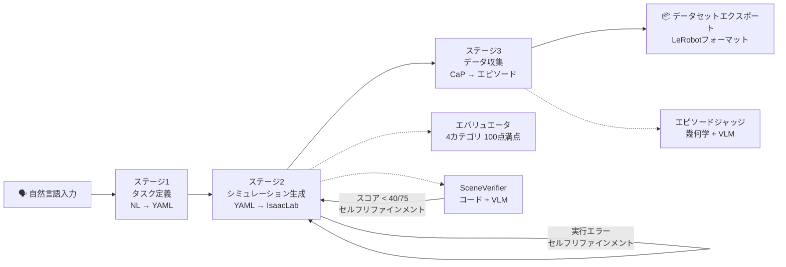
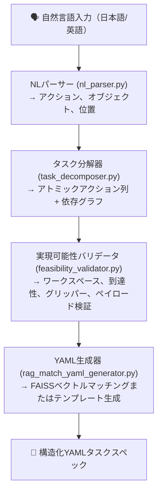
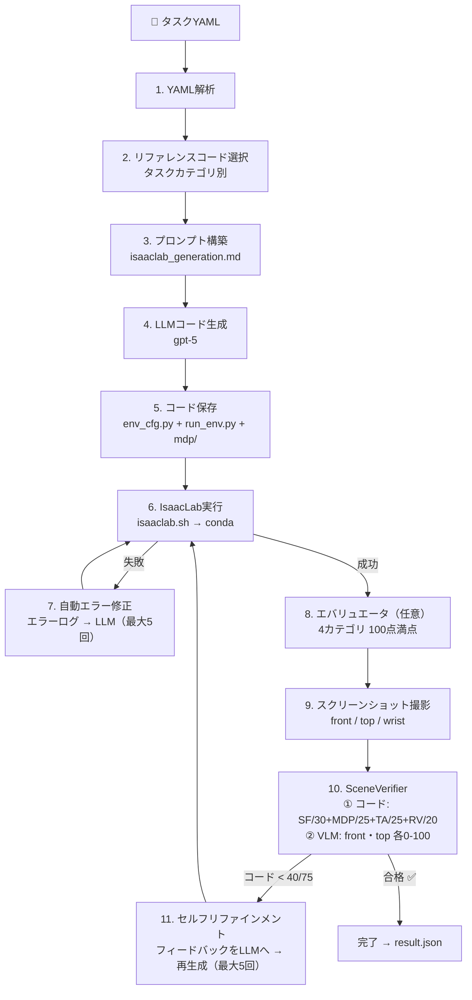

# パイプラインアーキテクチャ

[ English](../architecture.md) | [ 한국어](../ko/architecture.md) | [ 中文](../zh/architecture.md) | [ 日本語](architecture.md) | [ Deutsch](../de/architecture.md)

対象読者: システム全体のフローを理解したいユーザー
本ドキュメントの内容: 3ステージパイプライン構造、各ステージの内部動作、モジュール間関係
CLI使用方法については`docs/usage.md`を、インストールについては`docs/getting_started.md`をご覧ください

---

## 全体パイプライン

自然言語のタスク記述を入力として、3つのステージを経て学習可能なデモンストレーションデータセットを自動生成します。



| ステージ | 入力 | コア処理 | 出力 | エントリーポイント |
|-------|-------|----------------|--------|-------------|
| **1. タスク定義** | 自然言語文 | RAG検索 + LLM few-shot生成 | `task.yaml` | `scripts/task_spec_agent/task_spec_agent.py` |
| **2. シミュレーション生成** | task.yaml | LLMコード生成 + IsaacLab実行検証 | `env_cfg.py` + `run_env.py` + `mdp/` | `scripts/run_isaac_lab.py` |
| **3. データ収集** | task.yaml + env_dir | CaPスキルコード生成 → IK実行 → 評価 → 記録 | `raw_dataset/` | `scripts/run_data_collection.py` |

---

## ステージ1: タスク定義（NL → YAML）

> 実装場所: `scripts/task_spec_agent/`

自然言語コマンドを構造化YAMLタスクスペックに変換します。内部的には4段階のパイプラインを経ます。



### モジュールの役割

| モジュール | 入力 | 出力 | 説明 |
|--------|-------|--------|-------------|
| **NLパーサー** | 自然言語文 | `ParsedTask`（アクション、オブジェクト、位置） | LLMにJSONスキーマを指定して構造化出力を生成 |
| **タスク分解器** | `ParsedTask` | `TaskPlan`（AtomicActionリスト + 依存関係） | reach、grasp、lift、placeなどのアトミックアクションに分解。トポロジカルソートで循環を検証 |
| **実現可能性バリデータ** | `TaskPlan` | `ValidationResult`（is_valid、errors、warnings） | ロボットプロファイルに基づく6項目の物理検証（ワークスペース、到達性、グリッパー、ペイロード等） |
| **RAG YAML生成器** | 自然言語 + ParsedTask + TaskPlan | YAML文字列 | FAISSベクトル検索で最も類似する既存タスクYAMLをマッチングして返す |

### RAGベクトル検索

- 埋め込みモデル: `sentence-transformers/all-MiniLM-L6-v2`
- ベクトルストア: `data/vector_store/index.faiss`（初回実行時に自動生成）
- 検索元: `tasks/`ディレクトリ内の既存82 YAML
- ロボットタイプによるフィルタリングに対応（franka, ur10e, openarm, so101）

---

## ステージ2: シミュレーション生成（YAML → IsaacLab）

> 実装場所: `src/agent/isaac_lab/agent.py`

YAMLタスクスペックからIsaacLab `ManagerBasedRLEnv` Pythonコードを自動生成し、実行を検証します。



### SceneVerifier出力構造

```json
{
  "code_evaluation": {
    "scene_fidelity": {"score": 36, "max": 40, "details": "..."},
    "mdp_correctness": {"score": 17, "max": 20, "details": "..."},
    "task_alignment": {"score": 13, "max": 15, "details": "..."},
    "runtime_validity": {"score": 22, "max": 25, "details": "..."},
    "total_score": 92, "max_score": 100
  },
  "image_evaluation": {
    "front": {"score": 85, "reasoning": "..."},
    "top": {"score": 78, "reasoning": "..."},
    "vlm_pass": true
  },
  "overall_pass": true
}
```

### 生成コード構造

```
outputs/isaaclab/{TaskName}_{timestamp}/
├── env_cfg.py          # メイン環境設定
│   ├── SceneCfg        # ロボット、オブジェクト、照明、地面
│   ├── ActionsCfg      # 関節/グリッパー制御設定
│   ├── ObservationsCfg # 観測定義
│   ├── RewardsCfg      # 報酬関数
│   ├── TerminationsCfg # 終了条件
│   └── EventCfg        # 初期化/ランダム化イベント
├── run_env.py          # ランナー（AppLauncher → 環境作成 → 検証）
├── mdp/                # カスタムMDP関数（必要な場合）
│   ├── __init__.py     # isaaclab.envs.mdp + カスタムモジュールを再エクスポート
│   ├── rewards.py      # カスタム報酬関数
│   └── terminations.py # カスタム終了条件
├── debug/              # 環境スクリーンショット（front/top/wrist）
└── result.json         # 実行結果 + scene_verificationを含む
```

### YAML → IsaacLabマッピングルール

| YAMLセクション | IsaacLabマッピング |
|-------------|-----------------|
| `robot`（articulation） | プリセットを使用（`FRANKA_PANDA_CFG`、`UR10e_ROBOTIQ_2F_85_CFG`等） |
| `robot.initial_joints` | `ArticulationCfg.init_state.joint_pos` |
| `assets`（rigid） | `RigidObjectCfg`（USDまたはプリミティブベース） |
| `assets.position/rotation` | `init_state`設定 |
| `assets.physics` | `RigidBodyPropertiesCfg`、`CollisionPropertiesCfg` |
| `simulation.*` | `__post_init__`（decimation、episode_length、dt、PhysX） |
| `goal.conditions` | カスタム`mdp/terminations.py` |
| `randomization` | `EventTermCfg`（リセットイベント） |

### Isaac Simビジュアル検証（補助パス）

IsaacLabに加えて、Isaac Sim MCP拡張を利用したビジュアル検証パスもあります。

- TCP接続（`localhost:8766`）を介してIsaac Simと通信
- YAML → MCP `execute_script` → シーン構築 → スクリーンショット → VLM評価
- `src/agent/isaac_sim/`（runner.py、scene_builder.py、screenshot.py、vlm_evaluator.py）

---

## ステージ3: データ収集（CaP → データセット）

> 実装場所: `src/agent/data_collection/`

ステージ2で生成されたシミュレーション環境上でロボットがタスクを実行し、成功したエピソードのみをデータセットとして記録します。

```
タスクYAML + IsaacLab環境コード
    │
    ▼
┌────────────────────────────────────────────────────────┐
│  DataCollectionPipeline  (pipeline.py)                  │
│                                                        │
│  1. ロボットプロファイル読み込み (configs/robot_profiles/*.yaml) │
│  2. collect_data.pyを自動生成                           │
│  3. IsaacLab conda環境でサブプロセスとして実行            │
│                                                        │
│  ┌────────────────────────────────────────────────┐    │
│  │  collect_data.py（IsaacLabサブプロセス内）       │    │
│  │                                                │    │
│  │  while success_count < target:                 │    │
│  │    ┌──────────┐                                │    │
│  │    │ env.reset│  環境を初期化                    │    │
│  │    └────┬─────┘                                │    │
│  │         ▼                                      │    │
│  │    ┌──────────┐                                │    │
│  │    │ Detect   │  シーングラフからオブジェクト      │    │
│  │    │          │  位置を検出                      │    │
│  │    └────┬─────┘                                │    │
│  │         ▼                                      │    │
│  │    ┌──────────┐                                │    │
│  │    │ Plan     │  LLMがCaPスキルコードを生成       │    │
│  │    │          │ （pick、place、stack等）          │    │
│  │    └────┬─────┘                                │    │
│  │         ▼                                      │    │
│  │    ┌──────────┐                                │    │
│  │    │ Execute  │  6-DOF IK（Pinocchio）+         │    │
│  │    │          │  PD関節制御                      │    │
│  │    └────┬─────┘                                │    │
│  │         ▼                                      │    │
│  │    ┌──────────┐                                │    │
│  │    │ Judge    │  幾何学チェック + VLM判定         │    │
│  │    └────┬─────┘                                │    │
│  │         ▼                                      │    │
│  │    ┌──────────┐                                │    │
│  │    │ Record   │  成功時は保存 / 失敗時は          │    │
│  │    │          │  破棄                           │    │
│  │    └──────────┘                                │    │
│  └────────────────────────────────────────────────┘    │
└────────────────────────────────────────────────────────┘
    │
    ▼
  raw_dataset/ → export → preprocess → LeRobot Hub
```

### コアモジュール

| モジュール | 役割 |
|--------|------|
| **SimDetector** (`sim_detector.py`) | IsaacLabシーングラフからオブジェクトの位置/姿勢を検出 |
| **SkillPlanner** (`skill_planner.py`) | LLMベースのスキルシーケンス計画（タスク記述 + 検出結果 → スキルリスト） |
| **SimSkills** (`sim_skills.py`) | 6-DOF IK（Pinocchio）ベースのロボット制御。pick、place、stack、move_to_ready等 |
| **SimCamera** (`sim_camera.py`) | マルチカメラシステム（top: 俯瞰、wrist: ハンドマウント、front: VLM判定 + データセット） |
| **SimJudge** (`sim_judge.py`) | 3段階成功判定: (1) 幾何学、(2) VLM、(3) envフラグ |
| **SimRecorder** (`sim_recorder.py`) | ステップごとの観測/アクション/画像/スキルメタデータ保存。失敗エピソードは破棄 |

### エピソード成功判定

エピソード終了後、2段階の評価を行います:

1. **幾何学検証** -- シーングラフの座標を使用してゴール条件を直接検証（on_top_of、at_position等）
2. **VLMジャッジ** -- gpt-5が4枚の前後画像（wrist+front）を確認して成功を判定

最終判定ポリシー（`geometry_or_vlm`）:

| 幾何学 | VLM | データセットに含まれるか？ |
|----------|-----|---------------------|
| 合格 | 合格 | はい |
| 合格 | 不合格 | はい |
| 不合格 | 合格 | はい |
| 不合格 | 不合格 | いいえ（破棄） |

幾何学またはVLMのいずれかが合格すれば、エピソードはデータセットに含まれます。

### 生データセットスキーマ

| フィールド | dtype | Shape | 説明 |
|-------|-------|-------|-------------|
| `observation.state` | float32 | (N_dof,) | 関節位置 |
| `action` | float32 | (N_dof,) | 関節制御目標 |
| `observation.images.{top,wrist,front}` | image | (480, 640, 3) | カメラ画像 |
| `skill.natural_language` | string | (1,) | スキル自然言語記述 |
| `skill.type` | string | (1,) | スキルタイプ |
| `skill.progress` | float32 | (1,) | 進捗 |
| `skill.goal_position.joint` | float32 | (N_dof,) | 目標関節位置 |
| `skill.goal_position.world_xyzrpy` | float32 | (6,) | ワールド座標目標 |
| `skill.goal_position.robot_xyzrpy` | float32 | (6,) | ロボットベースフレーム目標 |
| `skill.goal_position.gripper` | float32 | (1,) | グリッパー状態 |

**ロボット別N_dof:** Franka=9、OpenARM=9、UR10e=12、SO-101=6

### データ後処理

```
raw_dataset/
    │  scripts/export_dataset.py (adc_compatibleスキーマ)
    ▼
exported_datasets/
    │  scripts/preprocess_dataset.py (train/val分割)
    ▼
preprocessed_datasets/ (train.jsonl, val.jsonl, stats.json)
    │  LeRobot変換（任意）
    ▼
LeRobot Hub (HuggingFace)
```

---

## 共有インフラストラクチャ

ステージ1、2、3で共有される基盤モジュールです。

| モジュール | 場所 | 役割 |
|--------|----------|------|
| **LLMクライアント** | `src/agent/common/llm_client.py` | OpenAI Responses APIラッパー。gpt-5のtemperature未対応を自動処理 |
| **トークントラッカー** | `src/agent/common/token_tracker.py` | APIトークン使用量追跡（JSONLクロスプロセス）。リアルタイムログ + テーブルレポート |
| **MCPクライアント** | `src/agent/common/mcp_client.py` | Isaac Sim MCP拡張とのTCP通信（localhost:8766） |
| **IsaacLabランタイム** | `src/agent/common/isaaclab_runtime.py` | IsaacLabパス解決、condaコマンド構築、GPU環境変数設定 |
| **タスクドキュメント** | `src/agent/common/task_docs.py` | YAMLタスクドキュメントの読み込み/検証/シリアライゼーション |

---

## 実行エントリーポイントマッピング

どのスクリプトがパイプラインのどの部分を実行するか:

| スクリプト | 実行範囲 | 説明 |
|--------|----------------|-------------|
| **`run_agent.sh`** | **ステージ1 → 2 → 3** | **メイン実行エントリーポイント（自然言語入力 → フルパイプライン）** |
| `run_agent.sh --mode isaac-lab` | ステージ2のみ | YAML → 環境コード生成/検証 |
| `run_agent.sh --mode data-collection` | ステージ3のみ | 既存環境でのデータ収集 |
| `run_agent.sh --mode e2e-batch` | ステージ2 → 3 + 後処理 | 設定ベースの大規模バッチ収集 |
| `scripts/run_full_test.sh` | ステージ1 → 2 → 3 | 13タスクのシーケンシャルベンチマーク |

> `run_agent.sh "自然言語タスク"`がステージ1（NL→YAML）から開始する**メインエントリーポイント**です。
> `--mode`オプションを使用して個別ステージを実行することもできます。

---

## 対応ロボット

| ロボット | DOF | グリッパー | 備考 |
|-------|-----|---------|-------|
| Franka Panda | 9 (7+2) | パラレルジョー | デフォルトテストロボット |
| UR10e | 12 (6+6) | Robotiq 2F-85 | 産業用 |
| OpenARM | 9 (7+2) | パラレルジョー | 低コストオープンソース |
| SO-101 | 6 (5+1) | パラレルジョー | 教育用コンパクト |

---

## 関連ドキュメント

- CLI使用方法: [docs/usage.md](usage.md)
- インストール: [docs/getting_started.md](getting_started.md)
