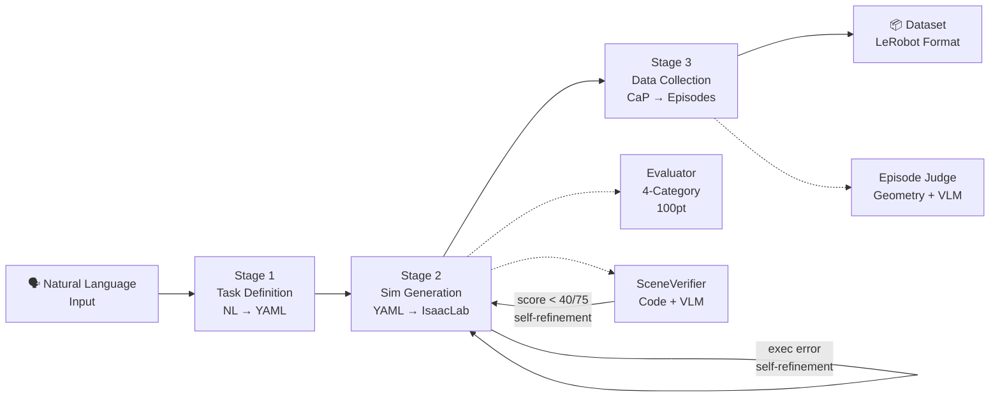

# Simulation-Generation-Agent (RAPIDS)

[ English](../../README.md) | [ 한국어](README.md) | [ 中文](../zh/README.md) | [ 日本語](../ja/README.md) | [ Deutsch](../de/README.md)

[](../../LICENSE)
[](https://www.python.org/)
[](https://github.com/isaac-sim/IsaacLab)
[](https://docs.omniverse.nvidia.com/isaacsim/)
[](docker.md)
[](https://openai.com/)
[](https://github.com/huggingface/lerobot)

An end-to-end robotics simulation automation framework that converts natural language task descriptions into structured YAML specs, auto-generates IsaacLab simulation environments, executes Code-as-Policies (CaP) robot manipulation, and collects training-ready demonstration datasets.

**Quick Start (English):**
```bash
git clone --recurse-submodules <repo-url> && cd Simulation-Generation-Agent
pip install -e . && cp .env.example .env  # Set OPENAI_API_KEY in .env
./run_agent.sh "Stack the blocks inside the tray on the table"
```

See [docs/getting_started.md](getting_started.md) for full setup and [docs/architecture.md](architecture.md) for pipeline details.

---

자연어 태스크 설명에서 시작해 YAML 태스크 명세 생성, IsaacLab 시뮬레이션 환경 코드 자동 구성, Code-as-Policies(CaP) 기반 로봇 조작 실행, 학습 가능 데이터셋 수집까지 연결하는 로봇 시뮬레이션 자동화 프레임워크입니다.

## 파이프라인 개요



| Stage | 무엇을 하는가 | 핵심 기술 |
|-------|-------------|----------|
| **1. Task Definition** | 자연어 → 구조화된 YAML 태스크 명세 | LangChain RAG (FAISS 벡터 매칭) + LLM 태스크 분해 |
| **2. Simulation Generation** | YAML → IsaacLab 환경 Python 코드 | LLM 코드 생성 + PhysX 실행 검증 + 에러 자동 수정 + VLM 환경 검증 |
| **3. Data Collection** | 환경 위에서 로봇 조작 + 성공 데이터 수집 | CaP 스킬 코드 생성 + Pinocchio IK + Geometry/VLM 이중 평가 |

상세 아키텍처: [docs/architecture.md](architecture.md)

## Quick Start

### 1. 설치

```bash
git clone --recurse-submodules <repo-url>
cd Simulation-Generation-Agent
pip install -e .
cp .env.example .env    # OPENAI_API_KEY를 설정하세요
```

### 2. 실행

```bash
./run_agent.sh "Stack the blocks inside the tray on the table"
```

옵션:
```bash
./run_agent.sh "Stack the blocks inside the tray on the table" --robot franka --episodes 5
```

### 3. Docker로 실행

```bash
git submodule update --init --recursive
docker build -t simgen-agent .

docker run --rm --gpus all \
  -v $(pwd)/artifacts:/workspace/artifacts \
  -e OPENAI_API_KEY="your-key" \
  simgen-agent \
  "Stack the blocks inside the tray on the table" --episodes 5
```

> **출력 경로**: Docker 내부에서는 `/workspace/artifacts`에 결과가 저장됩니다.
> 위 `-v` 옵션으로 호스트의 `./artifacts/`에 매핑됩니다.
> 로컬 실행 시에는 `outputs/` 디렉토리에 저장됩니다.

### 4. 개별 Stage 실행 (고급)

```bash
# Stage 2만: YAML → IsaacLab 환경 코드
./run_agent.sh --mode isaac-lab --task tasks/franka/stack/franka_stack.yaml

# Stage 3만: 데이터 수집
./run_agent.sh --mode data-collection --task tasks/franka/stack/franka_stack.yaml

# 대규모 배치 수집
./run_agent.sh --mode e2e-batch --config configs/docker/e2e_batch_release.yaml --resume
```

<details>
<summary>Python 스크립트 직접 실행 (개발자용)</summary>

```bash
# Stage 1: NL → YAML
python3 scripts/task_spec_agent/task_spec_agent.py "Stack the blocks" --robot franka --output task.yaml

# Stage 2: YAML → IsaacLab
python3 scripts/run_isaac_lab.py task.yaml --evaluate

# Stage 3: 데이터 수집
python3 scripts/run_data_collection.py task.yaml --env-dir outputs/isaaclab/<run_dir> --target-success 5

# 13개 태스크 일괄 실행
bash scripts/run_full_test.sh
```
</details>

## 지원 로봇

| 로봇 | DOF | 그리퍼 | 비고 |
|------|-----|--------|------|
| Franka Panda | 9 (7+2) | Parallel Jaw | 기본 테스트 로봇 |
| UR10e | 12 (6+6) | Robotiq 2F-85 | 산업용 |
| OpenARM | 9 (7+2) | Parallel Jaw | 저비용 오픈소스 |
| SO-101 | 6 (5+1) | Parallel Jaw | 교육용 소형 |

## 토큰 사용량 추적

```bash
export TOKEN_USAGE_FILE=outputs/token_usage.jsonl
export TOKEN_USAGE_LOG=1  # 실시간 콘솔 로그
./run_agent.sh "Stack the blocks inside the tray on the table"
# 실행 완료 시 step별/model별 토큰 리포트 출력
```

## 프로젝트 구조

```text
Simulation-Generation-Agent/
├── Dockerfile                    # Docker 이미지 빌드 설정
├── requirements.txt              # 파이썬 의존성 패키지 목록
├── run_agent.sh                  # 메인 실행 진입점 (전체 파이프라인)
├── .env.example                  # 환경변수 템플릿
├── LICENSE                       # MIT 라이선스
├── src/main.py                   # 메인 실행 진입점
├── scripts/
│   ├── task_spec_agent/          # Stage 1: NL → YAML
│   │   ├── task_spec_agent.py    #   메인 오케스트레이터
│   │   ├── nl_parser.py          #   자연어 파싱 (LLM)
│   │   ├── task_decomposer.py    #   태스크 분해 (LLM)
│   │   ├── feasibility_validator.py  # 물리적 실현 가능성 검증
│   │   ├── rag_match_yaml_generator.py # RAG 벡터 매칭 YAML 생성
│   │   └── llm_client.py         #   멀티 LLM 클라이언트
│   ├── run_isaac_lab.py          # Stage 2 진입점
│   ├── run_data_collection.py    # Stage 3 진입점
│   ├── run_e2e_batch.py          # E2E Batch 진입점
│   └── run_full_test.sh          # Full Pipeline (Stage 1→2→3)
├── src/agent/
│   ├── common/                   # LLM 클라이언트, 토큰 트래커, MCP
│   ├── isaac_lab/                # Stage 2: 환경 코드 생성 + 평가
│   │   ├── agent.py              #   IsaacLabAgent (LLM 코드 생성)
│   │   ├── scene_verifier.py     #   VLM 환경 검증 (코드 4-카테고리 + 이미지)
│   │   └── evaluator/            #   4-카테고리 100점 평가
│   ├── isaac_sim/                # Isaac Sim 시각 검증 (부가 경로)
│   ├── data_collection/          # Stage 3: 데이터 수집
│   │   ├── pipeline.py           #   DataCollectionPipeline
│   │   ├── sim_skills.py         #   6-DOF IK 로봇 제어
│   │   ├── sim_judge.py          #   Geometry + VLM 성공 판정
│   │   ├── cap_generator.py      #   CaP 코드 생성
│   │   └── e2e_orchestrator.py   #   E2E 배치 오케스트레이터
│   ├── kinematics/               # IK/FK 엔진 (Pinocchio)
│   └── task_search/              # task YAML 카탈로그/검색
├── configs/                      # 설정 파일
│   ├── robot_profiles/           #   로봇별 프로파일 (관절, 그리퍼, IK)
│   └── docker/                   #   Docker 전용 배치 설정
├── tasks/                        # task YAML corpus (82개)
├── prompts/                      # LLM 시스템 프롬프트
├── assets/                       # 로컬 USD/URDF 자산
├── external/AutoDataCollector/   # ADC submodule (judge 프롬프트, IK 유틸)
├── data/                         # 시연용 입력 데이터, RAG 벡터 스토어
└── docs/                         # 사용자 문서
```

## Task Corpus

- 총 task YAML: 82개
- 로봇: Franka (28), OpenARM (24), SO-101 (13), UR10e (17)
- 카테고리: Stack, Lift, Pick&Place, Sort, Cabinet, Assembly, Peg Insert, Reach

## 문서

| 문서 | 역할 |
|------|------|
| [architecture.md](architecture.md) | 3-Stage 파이프라인 아키텍처, 모듈 관계, 데이터 흐름 |
| [getting_started.md](getting_started.md) | 설치, 환경변수, submodule 세팅, 첫 실행 |
| [usage.md](usage.md) | CLI 사용법, 옵션, 출력 구조, 결과 해석 |
| [dataset.md](dataset.md) | 데이터셋 내보내기, LeRobot 변환, HuggingFace 업로드 |
| [docker.md](docker.md) | Docker 빌드/실행 가이드 |
| [LICENSE](../../LICENSE) | MIT 라이선스 |

## Docker / run_agent.sh 상세

상세 Docker 빌드·실행 가이드: [docker.md](docker.md)

`run_agent.sh --help`로 전체 옵션을 확인할 수 있습니다.

## 참고

- 생성 산출물은 로컬 실행 시 `outputs/`, Docker 실행 시 `/workspace/artifacts`에 저장됩니다.
- IK 엔진(`src/agent/kinematics/`)은 Pinocchio 기반이며 `pip install pin`이 필요합니다. Pinocchio 미설치 시 IsaacLab DifferentialIK로 자동 fallback됩니다.
- Isaac Sim MCP 시각 검증은 로컬 개발 환경 전용이며 Docker에서는 지원되지 않습니다.
