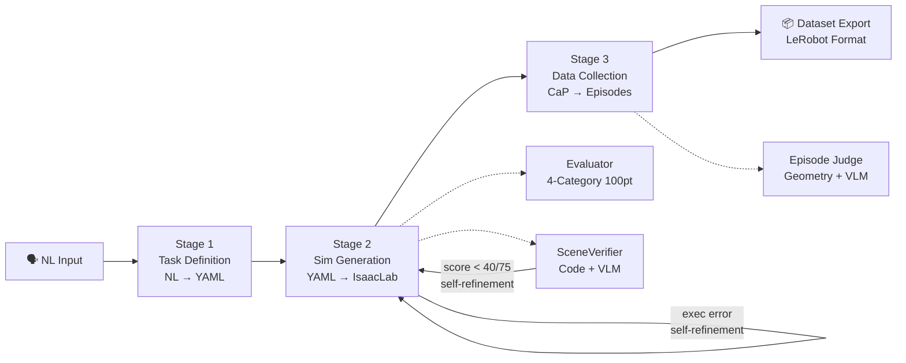
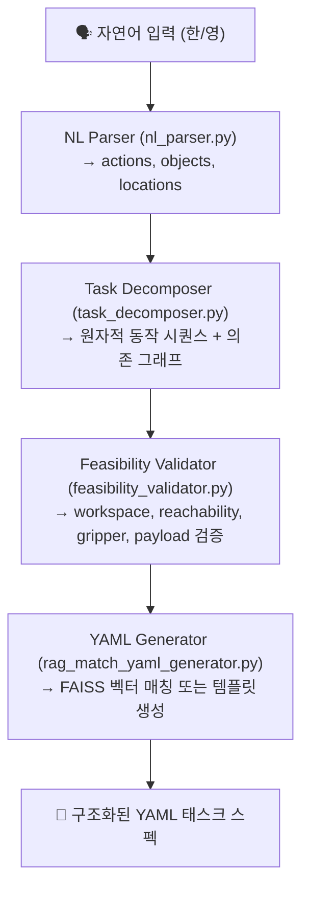
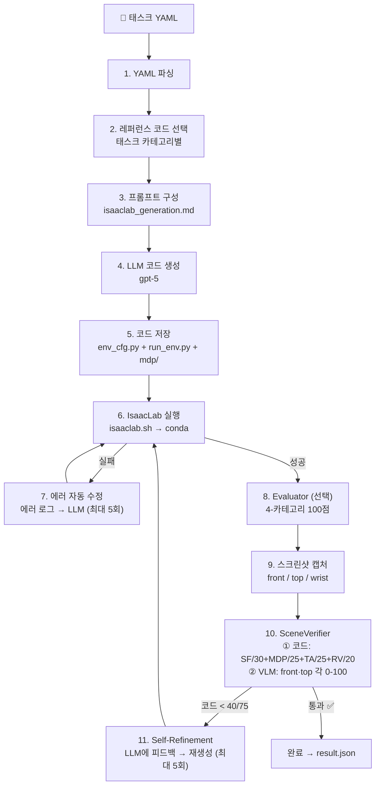

# 파이프라인 아키텍처

[ English](../architecture.md) | [ 한국어](architecture.md) | [ 中文](../zh/architecture.md) | [ 日本語](../ja/architecture.md) | [ Deutsch](../de/architecture.md)

대상: 전체 시스템 흐름을 이해하고 싶은 사용자
이 문서가 다루는 것: 3-Stage 파이프라인 구조, 각 Stage의 내부 동작, 모듈 간 관계
CLI 사용법은 `docs/usage.md`, 설치는 `docs/getting_started.md`

---

## 전체 파이프라인

자연어 태스크 설명을 입력하면, 3단계를 거쳐 학습 가능한 demonstration 데이터셋이 자동으로 생성됩니다.



| Stage | 입력 | 핵심 동작 | 출력 | 진입점 |
|-------|------|----------|------|--------|
| **1. Task Definition** | 자연어 문장 | RAG 검색 + LLM few-shot 생성 | `task.yaml` | `scripts/task_spec_agent/task_spec_agent.py` |
| **2. Simulation Generation** | task.yaml | LLM 코드 생성 + IsaacLab 실행 검증 | `env_cfg.py` + `run_env.py` + `mdp/` | `scripts/run_isaac_lab.py` |
| **3. Data Collection** | task.yaml + env_dir | CaP 스킬 코드 생성 → IK 실행 → 평가 → 기록 | `raw_dataset/` | `scripts/run_data_collection.py` |

---

## Stage 1: Task Definition (NL → YAML)

> 구현 위치: `scripts/task_spec_agent/`

자연어 명령을 구조화된 YAML 태스크 명세로 변환합니다. 내부적으로 4단계 파이프라인을 거칩니다.



### 각 모듈 역할

| 모듈 | 입력 | 출력 | 설명 |
|------|------|------|------|
| **NL Parser** | 자연어 문장 | `ParsedTask` (actions, objects, locations) | LLM에 JSON 스키마를 지정하여 구조화된 출력 생성 |
| **Task Decomposer** | `ParsedTask` | `TaskPlan` (AtomicAction 리스트 + 의존성) | reach, grasp, lift, place 등 원자적 동작 분해. 위상 정렬로 순환 검증 |
| **Feasibility Validator** | `TaskPlan` | `ValidationResult` (is_valid, errors, warnings) | 로봇 프로파일 기반 6가지 물리적 검증 (workspace, reachability, gripper, payload 등) |
| **RAG YAML Generator** | 자연어 + ParsedTask + TaskPlan | YAML 문자열 | FAISS 벡터 검색으로 가장 유사한 기존 태스크 YAML을 매칭하여 반환 |

### RAG 벡터 검색

- 임베딩 모델: `sentence-transformers/all-MiniLM-L6-v2`
- 벡터 스토어: `data/vector_store/index.faiss` (첫 실행 시 자동 생성)
- 검색 소스: `tasks/` 디렉토리의 기존 YAML 82개
- 로봇 유형 필터링 지원 (franka, ur10e, openarm, so101)

---

## Stage 2: Simulation Generation (YAML → IsaacLab)

> 구현 위치: `src/agent/isaac_lab/agent.py`

YAML 태스크 명세를 IsaacLab `ManagerBasedRLEnv` Python 코드로 자동 생성하고, 실행 검증합니다.



### SceneVerifier 출력 구조

```json
{
  "code_evaluation": {
    "scene_fidelity": {"score": 36, "max": 40, "details": "..."},
    "mdp_correctness": {"score": 17, "max": 20, "details": "..."},
    "task_alignment": {"score": 13, "max": 15, "details": "..."},
    "runtime_validity": {"score": 22, "max": 25, "details": "..."},
    "total_score": 92, "max_score": 100
  },
  "image_evaluation": {
    "front": {"score": 85, "reasoning": "..."},
    "top": {"score": 78, "reasoning": "..."},
    "vlm_pass": true
  },
  "overall_pass": true
}
```

### 생성되는 코드 구조

```
outputs/isaaclab/{TaskName}_{timestamp}/
├── env_cfg.py          # 메인 환경 설정
│   ├── SceneCfg        # 로봇, 오브젝트, 조명, 지면
│   ├── ActionsCfg      # 관절/그리퍼 제어 설정
│   ├── ObservationsCfg # 관측 정의
│   ├── RewardsCfg      # 보상 함수
│   ├── TerminationsCfg # 종료 조건
│   └── EventCfg        # 초기화/랜덤화 이벤트
├── run_env.py          # 실행기 (AppLauncher → 환경 생성 → 검증)
├── mdp/                # 커스텀 MDP 함수 (필요 시)
│   ├── __init__.py     # isaaclab.envs.mdp 재수출 + 커스텀 모듈
│   ├── rewards.py      # 커스텀 보상 함수
│   └── terminations.py # 커스텀 종료 조건
├── debug/              # 환경 스크린샷 (front/top/wrist)
└── result.json         # 실행 결과 + scene_verification 포함
```

### YAML → IsaacLab 매핑 규칙

| YAML 섹션 | IsaacLab 매핑 |
|-----------|--------------|
| `robot` (articulation) | 프리셋 사용 (`FRANKA_PANDA_CFG`, `UR10e_ROBOTIQ_2F_85_CFG` 등) |
| `robot.initial_joints` | `ArticulationCfg.init_state.joint_pos` |
| `assets` (rigid) | `RigidObjectCfg` (USD 또는 primitive 기반) |
| `assets.position/rotation` | `init_state` 설정 |
| `assets.physics` | `RigidBodyPropertiesCfg`, `CollisionPropertiesCfg` |
| `simulation.*` | `__post_init__` (decimation, episode_length, dt, PhysX) |
| `goal.conditions` | 커스텀 `mdp/terminations.py` |
| `randomization` | `EventTermCfg` (reset 이벤트) |

### Isaac Sim 시각 검증 (부가 경로)

IsaacLab 외에 Isaac Sim MCP 확장을 활용한 시각적 검증 경로도 있습니다.

- TCP 연결 (`localhost:8766`)로 Isaac Sim과 통신
- YAML → MCP `execute_script` → 장면 구성 → 스크린샷 → VLM 평가
- `src/agent/isaac_sim/` (runner.py, scene_builder.py, screenshot.py, vlm_evaluator.py)

---

## Stage 3: Data Collection (CaP → Dataset)

> 구현 위치: `src/agent/data_collection/`

Stage 2에서 생성한 시뮬레이션 환경 위에서 로봇이 태스크를 수행하고, 성공한 에피소드만 데이터셋으로 기록합니다.

```
태스크 YAML + IsaacLab 환경 코드
    │
    ▼
┌────────────────────────────────────────────────────────┐
│  DataCollectionPipeline  (pipeline.py)                  │
│                                                        │
│  1. 로봇 프로파일 로드 (configs/robot_profiles/*.yaml)   │
│  2. collect_data.py 자동 생성                           │
│  3. IsaacLab conda env에서 subprocess 실행              │
│                                                        │
│  ┌────────────────────────────────────────────────┐    │
│  │  collect_data.py (IsaacLab subprocess 내부)     │    │
│  │                                                │    │
│  │  while success_count < target:                 │    │
│  │    ┌──────────┐                                │    │
│  │    │ env.reset│  환경 초기화                     │    │
│  │    └────┬─────┘                                │    │
│  │         ▼                                      │    │
│  │    ┌──────────┐                                │    │
│  │    │ Detect   │  scene graph에서 물체 위치 감지   │    │
│  │    └────┬─────┘                                │    │
│  │         ▼                                      │    │
│  │    ┌──────────┐                                │    │
│  │    │ Plan     │  LLM이 CaP 스킬 코드 생성       │    │
│  │    │          │  (pick, place, stack 등)        │    │
│  │    └────┬─────┘                                │    │
│  │         ▼                                      │    │
│  │    ┌──────────┐                                │    │
│  │    │ Execute  │  6-DOF IK (Pinocchio) +        │    │
│  │    │          │  PD 관절 제어                    │    │
│  │    └────┬─────┘                                │    │
│  │         ▼                                      │    │
│  │    ┌──────────┐                                │    │
│  │    │ Judge    │  Geometry check + VLM 판정      │    │
│  │    └────┬─────┘                                │    │
│  │         ▼                                      │    │
│  │    ┌──────────┐                                │    │
│  │    │ Record   │  성공 시 저장 / 실패 시 폐기     │    │
│  │    └──────────┘                                │    │
│  └────────────────────────────────────────────────┘    │
└────────────────────────────────────────────────────────┘
    │
    ▼
  raw_dataset/ → export → preprocess → LeRobot Hub
```

### 핵심 모듈

| 모듈 | 역할 |
|------|------|
| **SimDetector** (`sim_detector.py`) | IsaacLab scene graph에서 물체 위치/자세 감지 |
| **SkillPlanner** (`skill_planner.py`) | LLM 기반 스킬 시퀀스 계획 (태스크 설명 + 감지 결과 → 스킬 목록) |
| **SimSkills** (`sim_skills.py`) | 6-DOF IK (Pinocchio) 기반 로봇 제어. pick, place, stack, move_to_ready 등 |
| **SimCamera** (`sim_camera.py`) | 멀티카메라 시스템 (top: 조감도, wrist: 손 장착, front: VLM 판정 + 데이터셋) |
| **SimJudge** (`sim_judge.py`) | 3-tier 성공 검증: (1) Geometry, (2) VLM, (3) env 플래그 |
| **SimRecorder** (`sim_recorder.py`) | 스텝별 관측/액션/이미지/스킬 메타데이터 저장. 실패 에피소드 폐기 |

### 에피소드 성공 판정

에피소드가 끝나면 2단계 평가를 거칩니다:

1. **Geometry Verification** — scene graph 좌표로 goal 조건을 직접 검증 (on_top_of, at_position 등)
2. **VLM Judge** — gpt-5가 before/after 이미지 4장(wrist+front)을 보고 성공 여부 판정

최종 판정 정책 (`geometry_or_vlm`):

| Geometry | VLM | 데이터셋 포함? |
|----------|-----|-------------|
| Pass | Pass | Yes |
| Pass | Fail | Yes |
| Fail | Pass | Yes |
| Fail | Fail | No (폐기) |

Geometry가 하나라도 통과하면 데이터셋에 포함됩니다.

### Raw Dataset 스키마

| 필드 | dtype | Shape | 설명 |
|------|-------|-------|------|
| `observation.state` | float32 | (N_dof,) | 관절 위치 |
| `action` | float32 | (N_dof,) | 관절 제어 목표 |
| `observation.images.{top,wrist,front}` | image | (480, 640, 3) | 카메라 이미지 |
| `skill.natural_language` | string | (1,) | 스킬 자연어 설명 |
| `skill.type` | string | (1,) | 스킬 유형 |
| `skill.progress` | float32 | (1,) | 진행률 |
| `skill.goal_position.joint` | float32 | (N_dof,) | 목표 관절 위치 |
| `skill.goal_position.world_xyzrpy` | float32 | (6,) | 월드 좌표 목표 |
| `skill.goal_position.robot_xyzrpy` | float32 | (6,) | 로봇 베이스 좌표 목표 |
| `skill.goal_position.gripper` | float32 | (1,) | 그리퍼 상태 |

**로봇별 N_dof:** Franka=9, OpenARM=9, UR10e=12, SO-101=6

### 데이터 후처리

```
raw_dataset/
    │  scripts/export_dataset.py (adc_compatible 스키마)
    ▼
exported_datasets/
    │  scripts/preprocess_dataset.py (train/val 분할)
    ▼
preprocessed_datasets/ (train.jsonl, val.jsonl, stats.json)
    │  LeRobot 변환 (선택)
    ▼
LeRobot Hub (HuggingFace)
```

---

## 공통 인프라

Stage 1, 2, 3이 공유하는 기반 모듈들입니다.

| 모듈 | 위치 | 역할 |
|------|------|------|
| **LLM Client** | `src/agent/common/llm_client.py` | OpenAI Responses API 래퍼. gpt-5 temperature 미지원 자동 처리 |
| **Token Tracker** | `src/agent/common/token_tracker.py` | API 토큰 사용량 추적 (JSONL 크로스 프로세스). 실시간 로그 + 테이블 리포트 |
| **MCP Client** | `src/agent/common/mcp_client.py` | Isaac Sim MCP 확장과 TCP 통신 (localhost:8766) |
| **IsaacLab Runtime** | `src/agent/common/isaaclab_runtime.py` | IsaacLab 경로 해석, conda 명령 구성, GPU 환경 변수 설정 |
| **Task Docs** | `src/agent/common/task_docs.py` | YAML 태스크 문서 로드/검증/직렬화 |

---

## 실행 진입점 매핑

어떤 스크립트가 파이프라인의 어떤 부분을 실행하는지:

| 스크립트 | 실행 범위 | 설명 |
|---------|----------|------|
| **`run_agent.sh`** | **Stage 1 → 2 → 3** | **메인 실행 진입점 (자연어 입력 → 전체 파이프라인)** |
| `run_agent.sh --mode isaac-lab` | Stage 2만 | YAML → 환경 코드 생성/검증 |
| `run_agent.sh --mode data-collection` | Stage 3만 | 기존 환경으로 데이터 수집 |
| `run_agent.sh --mode e2e-batch` | Stage 2 → 3 + 후처리 | config 기반 대규모 배치 수집 |
| `scripts/run_full_test.sh` | Stage 1 → 2 → 3 | 13개 태스크 순차 벤치마크 |

> `run_agent.sh "자연어 태스크"`가 Stage 1(NL→YAML)부터 시작하는 **메인 진입점**입니다.
> `--mode` 옵션으로 개별 Stage를 실행할 수도 있습니다.

---

## 지원 로봇

| 로봇 | DOF | 그리퍼 | 비고 |
|------|-----|--------|------|
| Franka Panda | 9 (7+2) | Parallel Jaw | 기본 테스트 로봇 |
| UR10e | 12 (6+6) | Robotiq 2F-85 | 산업용 |
| OpenARM | 9 (7+2) | Parallel Jaw | 저비용 오픈소스 |
| SO-101 | 6 (5+1) | Parallel Jaw | 교육용 소형 |

---

## 관련 문서

- CLI 사용법: [docs/usage.md](usage.md)
- 설치: [docs/getting_started.md](getting_started.md)
