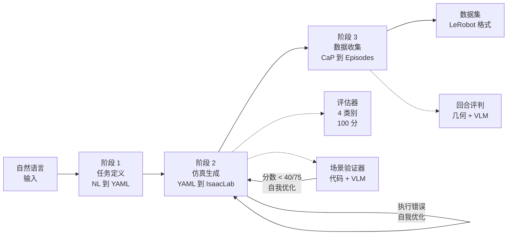

<h1 align="center">Simulation-Generation-Agent (RAPIDS)</h1>

<p align="center">
  <a href="https://skku-prism.github.io/rapid-project/">
    
  </a>
</p>

<p align="center">
  <a href="https://skku-prism.github.io/rapid-project/"></a>
</p>

---

<p align="center">
  <a href="../../README.md"> English</a> |
  <a href="../ko/README.md"> 한국어</a> |
  <a href="README.md"> 中文</a> |
  <a href="../ja/README.md"> 日本語</a> |
  <a href="../de/README.md"> Deutsch</a>
</p>

<p align="center">
  <a href="../../LICENSE"></a>
  <a href="https://www.python.org/"></a>
  <a href="https://github.com/isaac-sim/IsaacLab"></a>
  <a href="https://docs.omniverse.nvidia.com/isaacsim/"></a>
  <a href="docker.md"></a>
  <a href="https://openai.com/"></a>
  <a href="https://github.com/huggingface/lerobot"></a>
</p>

一个端到端的机器人仿真自动化框架，将自然语言任务描述转换为结构化 YAML 规范，自动生成 IsaacLab 仿真环境，执行代码即策略（CaP）机器人操作，并收集可用于训练的演示数据集。

```bash
git clone --recurse-submodules <repo-url> && cd Simulation-Generation-Agent
pip install -e . && cp .env.example .env
./run_agent.sh                           # 启动交互式 TUI 仪表板
```

**交互式 TUI** 是使用 RAPIDS 的主要方式。在单一终端界面中配置 API 密钥、选择机器人和模型、输入任务描述并观看完整流水线运行。按 **F1** 进入设置，**F2** 浏览运行历史（包含评分和数据集信息）。

<details>
<summary>CLI 模式（非交互式）</summary>

```bash
./run_agent.sh "Stack the blocks inside the tray on the table"
./run_agent.sh "Stack the blocks inside the tray on the table" --robot franka --episodes 5
```
</details>

完整安装说明请参阅 [getting_started.md](getting_started.md)，流水线详情请参阅 [architecture.md](architecture.md)。

---

## 流水线概览



| 阶段 | 功能 | 关键技术 |
|-------|------|----------|
| **1. 任务定义** | 自然语言转结构化 YAML 任务规范 | LangChain RAG（FAISS 向量匹配）+ LLM 任务分解 |
| **2. 仿真生成** | YAML 转 IsaacLab 环境 Python 代码 | LLM 代码生成 + PhysX 运行时验证 + 自动错误修复 + VLM 场景验证 |
| **3. 数据收集** | 在生成的环境上执行机器人操作 + 收集成功演示 | CaP 技能代码生成 + Pinocchio IK + 几何/VLM 双重评估 |

详细架构：[docs/architecture.md](architecture.md)

## 快速开始

### 1. 安装

```bash
git clone --recurse-submodules <repo-url>
cd Simulation-Generation-Agent
pip install -e .
cp .env.example .env    # 设置 OPENAI_API_KEY
```

### 2. 运行

```bash
./run_agent.sh    # 启动交互式 TUI 仪表板
```

配置 API 密钥（F1 → 设置），选择机器人/模型，输入任务 — 一切尽在一处。

<details>
<summary>CLI 模式（高级）</summary>

```bash
./run_agent.sh "Stack the blocks inside the tray on the table"
./run_agent.sh "Stack the blocks inside the tray on the table" --robot franka --episodes 5
```
</details>

### 3. 使用 Docker 运行

```bash
git submodule update --init --recursive
docker build -t simgen-agent .

# 交互式 TUI 模式
docker run -it --rm --gpus all \
  -v $(pwd)/outputs:/workspace/Simulation-Generation-Agent/outputs \
  --env-file .env simgen-agent

# 或直接 CLI 模式
docker run --rm --gpus all \
  -v $(pwd)/outputs:/workspace/Simulation-Generation-Agent/outputs \
  -v $(pwd)/results:/workspace/Simulation-Generation-Agent/results \
  -e OPENAI_API_KEY="your-key" \
  simgen-agent \
  "Stack the blocks inside the tray on the table" --episodes 5
```

> **输出路径**：Docker 中结果保存到 `/workspace/artifacts`，本地运行输出到 `outputs/`。
> API 密钥可以在 TUI 设置（F1）中配置，或通过 `--env-file .env` 传递。

### 4. 单独执行各阶段（高级）

```bash
# 仅阶段 2：YAML 到 IsaacLab 环境代码
./run_agent.sh --mode isaac-lab --task tasks/franka/stack/franka_stack.yaml

# 仅阶段 3：数据收集
./run_agent.sh --mode data-collection --task tasks/franka/stack/franka_stack.yaml

# 大规模批量收集
./run_agent.sh --mode e2e-batch --config configs/docker/e2e_batch_release.yaml --resume
```

<details>
<summary>直接运行 Python 脚本（面向开发者）</summary>

```bash
# 阶段 1：自然语言到 YAML
python3 scripts/task_spec_agent/task_spec_agent.py "Stack the blocks" --robot franka --output task.yaml

# 阶段 2：YAML 到 IsaacLab
python3 scripts/run_isaac_lab.py task.yaml --evaluate

# 阶段 3：数据收集
python3 scripts/run_data_collection.py task.yaml --env-dir outputs/isaaclab/<run_dir> --target-success 5

# 端到端运行全部 13 个任务
bash scripts/run_full_test.sh
```
</details>

## 支持的机器人

| 机器人 | 自由度 | 夹爪 | 备注 |
|--------|--------|------|------|
| Franka Panda | 9 (7+2) | 平行夹爪 | 主要测试机器人 |
| UR10e | 12 (6+6) | Robotiq 2F-85 | 工业级 |
| OpenARM | 9 (7+2) | 平行夹爪 | 低成本开源 |
| SO-101 | 6 (5+1) | 平行夹爪 | 教育型紧凑型 |

## Token 用量追踪

```bash
export TOKEN_USAGE_FILE=outputs/token_usage.jsonl
export TOKEN_USAGE_LOG=1  # 实时控制台日志
./run_agent.sh "Stack the blocks inside the tray on the table"
# 完成后打印每步和每模型的 token 报告
```

## 项目结构

```text
Simulation-Generation-Agent/
├── Dockerfile                    # Docker 镜像构建配置
├── requirements.txt              # Python 依赖列表
├── run_agent.sh                  # 主入口（完整流水线）
├── .env.example                  # 环境变量模板
├── LICENSE                       # MIT 许可证
├── src/main.py                   # 主入口（CLI 模式）
├── src/tui/                      # 交互式 TUI 仪表板（Textual）
├── scripts/
│   ├── task_spec_agent/          # 阶段 1：自然语言到 YAML
│   │   ├── task_spec_agent.py    #   主编排器
│   │   ├── nl_parser.py          #   自然语言解析（LLM）
│   │   ├── task_decomposer.py    #   任务分解（LLM）
│   │   ├── feasibility_validator.py  # 物理可行性检查
│   │   ├── rag_match_yaml_generator.py # RAG 向量匹配 YAML 生成
│   │   └── llm_client.py         #   多 LLM 客户端
│   ├── run_isaac_lab.py          # 阶段 2 入口
│   ├── run_data_collection.py    # 阶段 3 入口
│   ├── run_e2e_batch.py          # E2E 批量入口
│   └── run_full_test.sh          # 完整流水线（阶段 1->2->3）
├── src/agent/
│   ├── common/                   # LLM 客户端、token 追踪器、MCP
│   ├── isaac_lab/                # 阶段 2：环境代码生成 + 评估
│   │   ├── agent.py              #   IsaacLabAgent（LLM 代码生成）
│   │   ├── scene_verifier.py     #   VLM 场景验证（代码 4 类别 + 图像）
│   │   └── evaluator/            #   4 类别 100 分评估
│   ├── isaac_sim/                # Isaac Sim 视觉验证（辅助）
│   ├── data_collection/          # 阶段 3：数据收集
│   │   ├── pipeline.py           #   DataCollectionPipeline
│   │   ├── sim_skills.py         #   6-DOF IK 机器人控制
│   │   ├── sim_judge.py          #   几何 + VLM 成功评估
│   │   ├── cap_generator.py      #   CaP 代码生成
│   │   └── e2e_orchestrator.py   #   E2E 批量编排器
│   ├── kinematics/               # IK/FK 引擎（Pinocchio）
│   └── task_search/              # 任务 YAML 目录/搜索
├── configs/                      # 配置文件
│   ├── robot_profiles/           #   每个机器人的配置文件（关节、夹爪、IK）
│   └── docker/                   #   Docker 专用批量配置
├── tasks/                        # 任务 YAML 语料库（82 个任务）
├── prompts/                      # LLM 系统提示词
├── assets/                       # 本地 USD/URDF 资产
├── external/AutoDataCollector/   # ADC 子模块（评判提示词、IK 工具）
├── data/                         # 示例输入数据、RAG 向量存储
└── docs/                         # 用户文档
```

## 任务语料库

- 任务 YAML 总数：82
- 机器人：Franka (28)、OpenARM (24)、SO-101 (13)、UR10e (17)
- 类别：堆叠、抬起、拾取放置、分类、柜子、装配、插钉、到达

## 文档

| 文档 | 描述 |
|------|------|
| [architecture.md](architecture.md) | 3 阶段流水线架构、模块关系、数据流 |
| [getting_started.md](getting_started.md) | 安装、环境变量、子模块设置、首次运行 |
| [usage.md](usage.md) | CLI 用法、选项、输出结构、结果解读 |
| [dataset.md](dataset.md) | 数据集导出、LeRobot 转换、HuggingFace 上传 |
| [docker.md](docker.md) | Docker 构建/运行指南 |
| [CONTRIBUTING.md](../../CONTRIBUTING.md) | 贡献指南 |
| [LICENSE](../../LICENSE) | MIT 许可证 |

## 注意事项

- 生成的文件保存到 `outputs/`（本地运行）和 `/workspace/artifacts`（Docker）。
- IK 引擎（`src/agent/kinematics/`）基于 Pinocchio，需要 `pip install pin`。如果未安装 Pinocchio，则回退到 IsaacLab DifferentialIK。
- Isaac Sim MCP 视觉验证仅用于本地开发，不支持 Docker。
