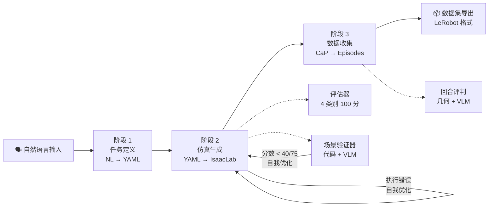
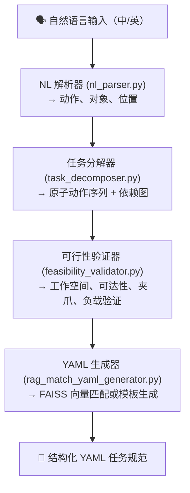
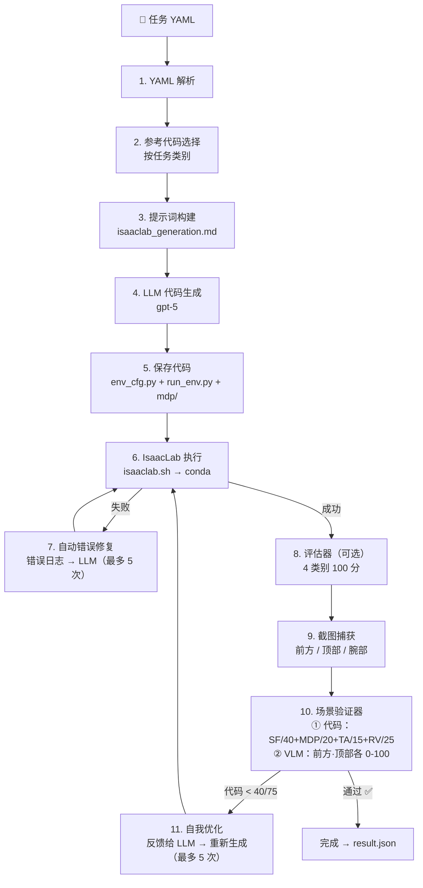

# 流水线架构

[ English](../architecture.md) | [ 한국어](../ko/architecture.md) | [ 中文](architecture.md) | [ 日本語](../ja/architecture.md) | [ Deutsch](../de/architecture.md)

目标读者：希望了解系统整体流程的用户
本文档涵盖：3 阶段流水线结构、各阶段的内部工作原理、模块间关系
CLI 用法请参阅 `docs/usage.md`，安装请参阅 `docs/getting_started.md`

---

## 整体流水线

给定自然语言任务描述作为输入，通过 3 个阶段自动生成可训练的演示数据集。



| 阶段 | 输入 | 核心操作 | 输出 | 入口 |
|-------|------|----------|------|------|
| **1. 任务定义** | 自然语言句子 | RAG 搜索 + LLM few-shot 生成 | `task.yaml` | `scripts/task_spec_agent/task_spec_agent.py` |
| **2. 仿真生成** | task.yaml | LLM 代码生成 + IsaacLab 执行验证 | `env_cfg.py` + `run_env.py` + `mdp/` | `scripts/run_isaac_lab.py` |
| **3. 数据收集** | task.yaml + env_dir | CaP 技能代码生成 → IK 执行 → 评估 → 记录 | `raw_dataset/` | `scripts/run_data_collection.py` |

---

## 阶段 1：任务定义（NL → YAML）

> 实现位置：`scripts/task_spec_agent/`

将自然语言命令转换为结构化 YAML 任务规范。内部经过 4 步流水线。



### 模块职责

| 模块 | 输入 | 输出 | 描述 |
|------|------|------|------|
| **NL 解析器** | 自然语言句子 | `ParsedTask`（动作、对象、位置） | 通过向 LLM 指定 JSON schema 生成结构化输出 |
| **任务分解器** | `ParsedTask` | `TaskPlan`（AtomicAction 列表 + 依赖关系） | 分解为 reach、grasp、lift、place 等原子动作。通过拓扑排序验证循环 |
| **可行性验证器** | `TaskPlan` | `ValidationResult`（is_valid, errors, warnings） | 基于机器人配置文件的 6 项物理验证（工作空间、可达性、夹爪、负载等） |
| **RAG YAML 生成器** | 自然语言 + ParsedTask + TaskPlan | YAML 字符串 | 通过 FAISS 向量搜索匹配并返回最相似的现有任务 YAML |

### RAG 向量搜索

- 嵌入模型：`sentence-transformers/all-MiniLM-L6-v2`
- 向量存储：`data/vector_store/index.faiss`（首次运行时自动生成）
- 搜索来源：`tasks/` 目录中的 82 个现有 YAML
- 支持按机器人类型筛选（franka, ur10e, openarm, so101）

---

## 阶段 2：仿真生成（YAML → IsaacLab）

> 实现位置：`src/agent/isaac_lab/agent.py`

从 YAML 任务规范自动生成 IsaacLab `ManagerBasedRLEnv` Python 代码并验证执行。



### 场景验证器输出结构

```json
{
  "code_evaluation": {
    "scene_fidelity": {"score": 36, "max": 40, "details": "..."},
    "mdp_correctness": {"score": 17, "max": 20, "details": "..."},
    "task_alignment": {"score": 13, "max": 15, "details": "..."},
    "runtime_validity": {"score": 22, "max": 25, "details": "..."},
    "total_score": 92, "max_score": 100
  },
  "image_evaluation": {
    "front": {"score": 85, "reasoning": "..."},
    "top": {"score": 78, "reasoning": "..."},
    "vlm_pass": true
  },
  "overall_pass": true
}
```

### 生成的代码结构

```
outputs/isaaclab/{TaskName}_{timestamp}/
├── env_cfg.py          # 主环境配置
│   ├── SceneCfg        # 机器人、对象、灯光、地面
│   ├── ActionsCfg      # 关节/夹爪控制设置
│   ├── ObservationsCfg # 观测定义
│   ├── RewardsCfg      # 奖励函数
│   ├── TerminationsCfg # 终止条件
│   └── EventCfg        # 初始化/随机化事件
├── run_env.py          # 运行器（AppLauncher → 环境创建 → 验证）
├── mdp/                # 自定义 MDP 函数（如需要）
│   ├── __init__.py     # 重导出 isaaclab.envs.mdp + 自定义模块
│   ├── rewards.py      # 自定义奖励函数
│   └── terminations.py # 自定义终止条件
├── debug/              # 环境截图（前方/顶部/腕部）
└── result.json         # 执行结果 + 包含 scene_verification
```

### YAML → IsaacLab 映射规则

| YAML 部分 | IsaacLab 映射 |
|-----------|--------------|
| `robot`（关节体） | 使用预设（`FRANKA_PANDA_CFG`、`UR10e_ROBOTIQ_2F_85_CFG` 等） |
| `robot.initial_joints` | `ArticulationCfg.init_state.joint_pos` |
| `assets`（刚体） | `RigidObjectCfg`（基于 USD 或基础几何体） |
| `assets.position/rotation` | `init_state` 配置 |
| `assets.physics` | `RigidBodyPropertiesCfg`、`CollisionPropertiesCfg` |
| `simulation.*` | `__post_init__`（decimation、episode_length、dt、PhysX） |
| `goal.conditions` | 自定义 `mdp/terminations.py` |
| `randomization` | `EventTermCfg`（重置事件） |

### Isaac Sim 视觉验证（辅助路径）

除了 IsaacLab 之外，还有一条利用 Isaac Sim MCP 扩展的视觉验证路径。

- 通过 TCP 连接与 Isaac Sim 通信（`localhost:8766`）
- YAML → MCP `execute_script` → 场景构建 → 截图 → VLM 评估
- `src/agent/isaac_sim/`（runner.py、scene_builder.py、screenshot.py、vlm_evaluator.py）

---

## 阶段 3：数据收集（CaP → 数据集）

> 实现位置：`src/agent/data_collection/`

机器人在阶段 2 生成的仿真环境上执行任务，仅将成功的回合记录为数据集。

```
任务 YAML + IsaacLab 环境代码
    │
    ▼
┌────────────────────────────────────────────────────────┐
│  DataCollectionPipeline  (pipeline.py)                  │
│                                                        │
│  1. 加载机器人配置文件 (configs/robot_profiles/*.yaml)   │
│  2. 自动生成 collect_data.py                            │
│  3. 在 IsaacLab conda 环境中作为子进程执行               │
│                                                        │
│  ┌────────────────────────────────────────────────┐    │
│  │  collect_data.py（IsaacLab 子进程内部）          │    │
│  │                                                │    │
│  │  while success_count < target:                 │    │
│  │    ┌──────────┐                                │    │
│  │    │ env.reset│  初始化环境                      │    │
│  │    └────┬─────┘                                │    │
│  │         ▼                                      │    │
│  │    ┌──────────┐                                │    │
│  │    │ 检测     │  从场景图中检测对象位置            │    │
│  │    │          │                                │    │
│  │    └────┬─────┘                                │    │
│  │         ▼                                      │    │
│  │    ┌──────────┐                                │    │
│  │    │ 规划     │  LLM 生成 CaP 技能代码           │    │
│  │    │          │  (pick, place, stack 等)        │    │
│  │    └────┬─────┘                                │    │
│  │         ▼                                      │    │
│  │    ┌──────────┐                                │    │
│  │    │ 执行     │  6-DOF IK (Pinocchio) +        │    │
│  │    │          │  PD 关节控制                    │    │
│  │    └────┬─────┘                                │    │
│  │         ▼                                      │    │
│  │    ┌──────────┐                                │    │
│  │    │ 评判     │  几何检查 + VLM 判定             │    │
│  │    └────┬─────┘                                │    │
│  │         ▼                                      │    │
│  │    ┌──────────┐                                │    │
│  │    │ 记录     │  成功时保存 / 失败时丢弃          │    │
│  │    │          │                                │    │
│  │    └──────────┘                                │    │
│  └────────────────────────────────────────────────┘    │
└────────────────────────────────────────────────────────┘
    │
    ▼
  raw_dataset/ → 导出 → 预处理 → LeRobot Hub
```

### 核心模块

| 模块 | 职责 |
|------|------|
| **SimDetector** (`sim_detector.py`) | 从 IsaacLab 场景图中检测对象位置/姿态 |
| **SkillPlanner** (`skill_planner.py`) | 基于 LLM 的技能序列规划（任务描述 + 检测结果 → 技能列表） |
| **SimSkills** (`sim_skills.py`) | 基于 6-DOF IK (Pinocchio) 的机器人控制。pick、place、stack、move_to_ready 等 |
| **SimCamera** (`sim_camera.py`) | 多相机系统（top：鸟瞰视图，wrist：手腕安装，front：VLM 判定 + 数据集） |
| **SimJudge** (`sim_judge.py`) | 3 层成功验证：(1) 几何、(2) VLM、(3) 环境标志 |
| **SimRecorder** (`sim_recorder.py`) | 每步观测/动作/图像/技能元数据存储。丢弃失败回合 |

### 回合成功判定

回合结束后，经过 2 阶段评估：

1. **几何验证** -- 使用场景图坐标直接验证目标条件（on_top_of、at_position 等）
2. **VLM 评判** -- gpt-5 检查 4 张前后对比图像（wrist+front）来判定成功

最终判定策略（`geometry_or_vlm`）：

| 几何 | VLM | 是否纳入数据集？ |
|------|-----|-----------------|
| 通过 | 通过 | 是 |
| 通过 | 失败 | 是 |
| 失败 | 通过 | 是 |
| 失败 | 失败 | 否（丢弃） |

只要几何或 VLM 其中之一通过，该回合就会被纳入数据集。

### 原始数据集 Schema

| 字段 | 数据类型 | 形状 | 描述 |
|------|----------|------|------|
| `observation.state` | float32 | (N_dof,) | 关节位置 |
| `action` | float32 | (N_dof,) | 关节控制目标 |
| `observation.images.{top,wrist,front}` | image | (480, 640, 3) | 相机图像 |
| `skill.natural_language` | string | (1,) | 技能自然语言描述 |
| `skill.type` | string | (1,) | 技能类型 |
| `skill.progress` | float32 | (1,) | 进度 |
| `skill.goal_position.joint` | float32 | (N_dof,) | 目标关节位置 |
| `skill.goal_position.world_xyzrpy` | float32 | (6,) | 世界坐标目标 |
| `skill.goal_position.robot_xyzrpy` | float32 | (6,) | 机器人基座坐标系目标 |
| `skill.goal_position.gripper` | float32 | (1,) | 夹爪状态 |

**各机器人 N_dof：** Franka=9、OpenARM=9、UR10e=12、SO-101=6

### 数据后处理

```
raw_dataset/
    │  scripts/export_dataset.py (adc_compatible schema)
    ▼
exported_datasets/
    │  scripts/preprocess_dataset.py (train/val split)
    ▼
preprocessed_datasets/ (train.jsonl, val.jsonl, stats.json)
    │  LeRobot 转换（可选）
    ▼
LeRobot Hub (HuggingFace)
```

---

## 共享基础设施

以下是阶段 1、2、3 共享的基础模块。

| 模块 | 位置 | 职责 |
|------|------|------|
| **LLM 客户端** | `src/agent/common/llm_client.py` | OpenAI Responses API 封装。自动处理 gpt-5 不支持 temperature 的情况 |
| **Token 追踪器** | `src/agent/common/token_tracker.py` | API token 用量追踪（JSONL 跨进程）。实时日志 + 表格报告 |
| **MCP 客户端** | `src/agent/common/mcp_client.py` | 与 Isaac Sim MCP 扩展的 TCP 通信（localhost:8766） |
| **IsaacLab 运行时** | `src/agent/common/isaaclab_runtime.py` | IsaacLab 路径解析、conda 命令构建、GPU 环境变量设置 |
| **任务文档** | `src/agent/common/task_docs.py` | YAML 任务文档加载/验证/序列化 |

---

## 执行入口映射

各脚本运行流水线的哪个部分：

| 脚本 | 执行范围 | 描述 |
|------|----------|------|
| **`run_agent.sh`** | **阶段 1 → 2 → 3** | **主执行入口（自然语言输入 → 完整流水线）** |
| `run_agent.sh --mode isaac-lab` | 仅阶段 2 | YAML → 环境代码生成/验证 |
| `run_agent.sh --mode data-collection` | 仅阶段 3 | 使用现有环境进行数据收集 |
| `run_agent.sh --mode e2e-batch` | 阶段 2 → 3 + 后处理 | 基于配置的大规模批量收集 |
| `scripts/run_full_test.sh` | 阶段 1 → 2 → 3 | 13 个任务的顺序基准测试 |

> `run_agent.sh "自然语言任务"` 是从阶段 1（NL→YAML）开始的**主入口**。
> 也可以使用 `--mode` 选项单独运行各阶段。

---

## 支持的机器人

| 机器人 | 自由度 | 夹爪 | 备注 |
|--------|--------|------|------|
| Franka Panda | 9 (7+2) | 平行夹爪 | 默认测试机器人 |
| UR10e | 12 (6+6) | Robotiq 2F-85 | 工业级 |
| OpenARM | 9 (7+2) | 平行夹爪 | 低成本开源 |
| SO-101 | 6 (5+1) | 平行夹爪 | 教育型紧凑型 |

---

## 相关文档

- CLI 用法：[docs/usage.md](usage.md)
- 安装：[docs/getting_started.md](getting_started.md)
